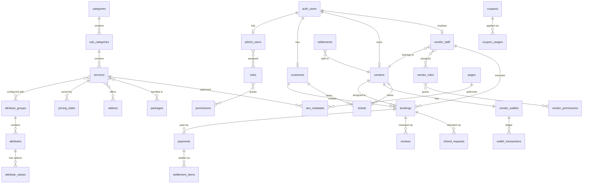

# DODO BOOKER — Database Architecture

> **Document Version:** 1.0  
> **Last Updated:** June 2026  
> **Database:** Supabase PostgreSQL  
> **Scope:** Schema design for all platform data modules

---

## Table of Contents

1. [Overview](#1-overview)
2. [Design Principles](#2-design-principles)
3. [Schema Conventions](#3-schema-conventions)
4. [Entity Relationship Overview](#4-entity-relationship-overview)
5. [Module Definitions](#5-module-definitions)
   - [RBAC](#51-rbac)
   - [Customers](#52-customers)
   - [Vendors](#53-vendors)
   - [Vendor Staff](#54-vendor-staff)
   - [Categories](#55-categories)
   - [Sub Categories](#56-sub-categories)
   - [Services](#57-services)
   - [Dynamic Attributes](#58-dynamic-attributes)
   - [Pricing Slabs](#59-pricing-slabs)
   - [Packages](#510-packages)
   - [Addons](#511-addons)
   - [Bookings](#512-bookings)
   - [Payments](#513-payments)
   - [Wallets](#514-wallets)
   - [Coupons](#515-coupons)
   - [Reviews](#516-reviews)
   - [Tickets](#517-tickets)
   - [Refunds](#518-refunds)
   - [Notifications](#519-notifications)
   - [CMS](#520-cms)
   - [SEO](#521-seo)
   - [Audit Logs](#522-audit-logs)
6. [Cross-Module Relationships](#6-cross-module-relationships)
7. [Storage Integration](#7-storage-integration)
8. [Indexing Strategy](#8-indexing-strategy)
9. [Related Documents](#9-related-documents)

---

## 1. Overview

The DODO BOOKER database is a single **Supabase PostgreSQL** schema shared by all applications — Admin Panel, Customer App, Vendor App, and Edge Functions. Data is organized into **logical modules** (table groups), each owning a distinct domain of the platform.

### Architecture Summary

```
┌────────────────────────────────────────────────────────────────────┐
│                     SUPABASE POSTGRESQL                            │
├────────────────────────────────────────────────────────────────────┤
│  auth.users (Supabase Auth)                                        │
│       │                                                            │
│       ├── Identity Profiles ──→ customers, admin_users,            │
│       │                         vendors, vendor_staff              │
│       │                                                            │
│       ├── RBAC ──→ roles, permissions, vendor_roles              │
│       │                                                            │
│       ├── Catalog ──→ categories → sub_categories → services       │
│       │               → attributes → pricing_slabs → packages      │
│       │               → addons                                       │
│       │                                                            │
│       ├── Operations ──→ bookings → assignments → work_proofs      │
│       │                                                            │
│       ├── Financial ──→ payments → wallets → settlements           │
│       │                  → refunds → coupons                         │
│       │                                                            │
│       ├── Engagement ──→ reviews, tickets, notifications         │
│       │                                                            │
│       └── Platform ──→ cms, seo, audit_logs, settings            │
└────────────────────────────────────────────────────────────────────┘
```

### Module Count

| Category | Modules |
|----------|---------|
| Identity & Access | RBAC, Customers, Vendors, Vendor Staff |
| Service Catalog | Categories, Sub Categories, Services, Dynamic Attributes, Pricing Slabs, Packages, Addons |
| Operations | Bookings |
| Financial | Payments, Wallets, Coupons, Refunds |
| Engagement | Reviews, Tickets, Notifications |
| Content | CMS, SEO |
| Compliance | Audit Logs |

---

## 2. Design Principles

| Principle | Description |
|-----------|-------------|
| **Single schema** | All applications read/write the same PostgreSQL schema |
| **UUID primary keys** | All tables use UUID primary keys for distributed-safe identifiers |
| **Auth separation** | `auth.users` (Supabase Auth) is separate from domain profile tables |
| **Soft lifecycle** | Records use status fields (`is_active`, `status`) rather than hard deletes where history matters |
| **Snapshot on write** | Bookings and payments store pricing snapshots so catalog changes do not alter historical records |
| **Dynamic configuration** | Catalog, attributes, pricing, roles, and permissions are data — not application code |
| **Tenant scoping** | Vendor data scoped by `vendor_id`; customer data scoped by `customer_id` |
| **RLS on all tables** | Every business table has Row Level Security enabled (see [RBAC_ARCHITECTURE.md](./RBAC_ARCHITECTURE.md)) |
| **Audit everything critical** | Permission-sensitive mutations produce audit log entries |
| **Timestamps on all tables** | `created_at` and `updated_at` on every table; domain-specific timestamps where needed |

---

## 3. Schema Conventions

### 3.1 Standard Columns

Every table includes these columns unless noted otherwise:

| Column | Type | Description |
|--------|------|-------------|
| `id` | UUID | Primary key, auto-generated |
| `created_at` | Timestamptz | Record creation timestamp (UTC) |
| `updated_at` | Timestamptz | Last modification timestamp (UTC) |

### 3.2 Common Patterns

| Pattern | Usage |
|---------|-------|
| `user_id` | Foreign key to `auth.users.id` — links auth identity to profile |
| `status` | Enum-like text field for lifecycle state (e.g., `pending`, `active`, `suspended`) |
| `is_active` | Boolean flag for soft enable/disable without deletion |
| `sort_order` | Integer for display ordering in catalog and CMS |
| `metadata` | JSONB for extensible attributes without schema changes |
| `deleted_at` | Nullable timestamp for soft delete where records must be hidden but retained |

### 3.3 Naming Conventions

| Convention | Example |
|------------|---------|
| Table names | Plural snake_case: `booking_addons`, `vendor_staff` |
| Junction tables | `{entity_a}_{entity_b}`: `role_permissions`, `package_services` |
| Foreign keys | `{referenced_table_singular}_id`: `customer_id`, `vendor_id` |
| Status history | `{entity}_status_history`: `booking_status_history` |

### 3.4 Supabase Auth Integration

All human identities authenticate through `auth.users`. Domain profile tables reference `auth.users.id` via `user_id`:

| Profile Table | Identity Type | Application |
|---------------|---------------|-------------|
| `admin_users` | Super Admin, Admin User | Admin Panel |
| `customers` | Customer | Customer App / PWA |
| `vendors` | Vendor Owner | Vendor App |
| `vendor_staff` | Vendor Staff | Vendor App |

A single `auth.users` record maps to **at most one** domain profile table.

---

## 4. Entity Relationship Overview

### 4.1 Catalog Hierarchy

```
categories
  └── sub_categories
        └── services
              ├── service_attribute_groups ──→ attribute_groups
              │                                    └── attributes
              │                                          └── attribute_values
              ├── pricing_slabs ──→ pricing_slab_conditions
              ├── pricing_rules ──→ pricing_rule_conditions
              ├── service_addons ──→ addons
              ├── service_images
              ├── service_faqs
              └── service_locations

packages
  └── package_services ──→ services
  └── package_pricing
```

### 4.2 Identity & Access

```
auth.users
  ├── admin_users ──→ admin_user_roles ──→ roles ──→ role_permissions ──→ permissions
  │                                                      └── permission_groups
  ├── customers ──→ customer_addresses
  │              └── customer_tag_assignments ──→ customer_tags
  ├── vendors ──→ vendor_documents
  │            ├── vendor_service_offerings ──→ services
  │            ├── vendor_coverage_areas
  │            └── vendor_wallets ──→ wallet_transactions
  └── vendor_staff ──→ vendor_staff_roles ──→ vendor_roles ──→ vendor_role_permissions ──→ vendor_permissions
                (belongs to vendors)
```

### 4.3 Booking & Financial Flow

```
customers
  └── bookings ──→ booking_items ──→ services / packages
              ├── booking_addons ──→ addons
              ├── booking_attribute_values ──→ attributes / attribute_values
              ├── booking_schedules
              ├── booking_assignments ──→ vendors / vendor_staff
              ├── booking_status_history
              ├── booking_work_proofs
              ├── booking_pricing_breakdown
              └── booking_otp_verifications

bookings
  └── payments
  └── invoices ──→ invoice_items
  └── reviews
  └── refund_requests ──→ refund_transactions
  └── tickets

vendors
  └── settlements ──→ settlement_items ──→ payments
  └── withdrawal_requests
```

---

## 5. Module Definitions

---

### 5.1 RBAC

#### Purpose

Stores platform-level role-based access control for Admin Panel users. Defines roles, permissions, permission groups, and their assignments. Supports dynamic creation and configuration of access rules without code changes. Separate from Vendor Staff RBAC (see [Section 5.4](#54-vendor-staff)).

#### Tables

| Table | Description | Key Fields |
|-------|-------------|------------|
| `roles` | Admin roles (e.g., Operations Manager, Finance Manager) | `name`, `slug`, `description`, `is_system`, `is_active` |
| `permissions` | Atomic permission units | `key` (e.g., `booking.view`), `name`, `description`, `module` |
| `permission_groups` | Logical groupings of permissions for UI assignment | `name`, `slug`, `description`, `sort_order` |
| `permission_group_permissions` | Junction: which permissions belong to which group | `permission_group_id`, `permission_id` |
| `role_permissions` | Junction: which permissions a role grants | `role_id`, `permission_id` |
| `admin_users` | Admin Panel user profiles | `user_id`, `full_name`, `email`, `is_super_admin`, `is_active`, `last_login_at` |
| `admin_user_roles` | Junction: roles assigned to admin users | `admin_user_id`, `role_id` |
| `login_logs` | Authentication attempt history | `user_id`, `identity_type`, `ip_address`, `user_agent`, `status`, `failure_reason` |
| `session_logs` | Active and expired session tracking | `user_id`, `session_id`, `ip_address`, `started_at`, `expired_at` |

#### Relationships

```
admin_users ──user_id──→ auth.users
admin_users ──< admin_user_roles >── roles
roles ──< role_permissions >── permissions
permissions ──< permission_group_permissions >── permission_groups
login_logs ──user_id──→ auth.users
session_logs ──user_id──→ auth.users
```

| From | To | Cardinality | Description |
|------|----|-------------|-------------|
| `admin_users` | `auth.users` | Many → One | Each admin profile links to one auth identity |
| `admin_users` | `roles` | Many → Many | Via `admin_user_roles`; admin can hold multiple roles |
| `roles` | `permissions` | Many → Many | Via `role_permissions` |
| `permissions` | `permission_groups` | Many → Many | Via `permission_group_permissions` |

---

### 5.2 Customers

#### Purpose

Stores end-customer profiles, addresses, tags, and engagement data. Customers authenticate via mobile OTP. Profile completion is required before booking. Supports CRM tagging and wishlist functionality.

#### Tables

| Table | Description | Key Fields |
|-------|-------------|------------|
| `customers` | Customer profile | `user_id`, `full_name`, `mobile`, `email`, `profile_image_url`, `is_profile_complete`, `is_active`, `is_blocked`, `blocked_reason`, `blocked_by`, `total_bookings`, `total_spend` |
| `customer_addresses` | Saved delivery/service addresses | `customer_id`, `label` (home/office/other), `house_number`, `street`, `area`, `landmark`, `city_id`, `state_id`, `pincode_id`, `latitude`, `longitude`, `is_default` |
| `customer_tags` | Admin-defined customer labels | `name`, `slug`, `color`, `description`, `is_active` |
| `customer_tag_assignments` | Junction: tags applied to customers | `customer_id`, `customer_tag_id`, `assigned_by` |
| `wishlists` | Saved services and packages for future booking | `customer_id`, `item_type` (service/package), `item_id` |
| `customer_vendor_ratings` | Vendor ratings of customers (dispute management) | `customer_id`, `vendor_id`, `booking_id`, `rating_type`, `notes`, `rated_by` (vendor_staff_id) |

#### Relationships

```
customers ──user_id──→ auth.users
customers ──< customer_addresses
customers ──< customer_tag_assignments >── customer_tags
customers ──< wishlists ──→ services / packages (polymorphic via item_type + item_id)
customers ──< customer_vendor_ratings
customer_addresses ──city_id──→ cities
customer_addresses ──pincode_id──→ pincodes
```

| From | To | Cardinality | Description |
|------|----|-------------|-------------|
| `customers` | `auth.users` | Many → One | One auth identity per customer |
| `customers` | `customer_addresses` | One → Many | Multiple saved addresses |
| `customers` | `customer_tags` | Many → Many | Via `customer_tag_assignments` |
| `customers` | `bookings` | One → Many | Customer creates bookings |
| `customers` | `reviews` | One → Many | Customer submits reviews |
| `customers` | `tickets` | One → Many | Customer raises support tickets |

---

### 5.3 Vendors

#### Purpose

Stores vendor organization profiles, KYC documents, service offerings, geographic coverage, availability schedules, and performance data. Manages the vendor lifecycle from application through approval, activation, and suspension.

#### Tables

| Table | Description | Key Fields |
|-------|-------------|------------|
| `vendors` | Vendor organization profile | `user_id`, `business_name`, `owner_name`, `mobile`, `email`, `address`, `profile_image_url`, `gst_number`, `business_type`, `registration_number`, `status` (applied/pending/approved/active/suspended), `is_active`, `average_rating`, `total_bookings`, `acceptance_rate`, `completion_rate` |
| `vendor_bank_details` | Bank account for settlements | `vendor_id`, `account_holder_name`, `account_number`, `ifsc_code`, `bank_name`, `is_verified` |
| `vendor_document_types` | Admin-configured required document types | `name`, `slug`, `description`, `is_required`, `has_expiry`, `is_active` |
| `vendor_documents` | Uploaded KYC/verification documents | `vendor_id`, `document_type_id`, `file_url`, `status` (draft/submitted/under_review/approved/rejected), `expiry_date`, `reviewed_by`, `rejection_reason` |
| `vendor_service_offerings` | Services the vendor has activated | `vendor_id`, `service_id`, `is_active`, `activated_at` |
| `vendor_service_prices` | Vendor-controlled pricing overrides | `vendor_id`, `service_id`, `price`, `addon_id` (nullable), `package_id` (nullable) |
| `vendor_coverage_areas` | Geographic service coverage | `vendor_id`, `coverage_type` (country/state/city/zone/area/pincode/radius), `location_id`, `radius_km`, `is_active` |
| `vendor_availability_schedules` | Weekly working hours | `vendor_id`, `day_of_week`, `start_time`, `end_time`, `is_active` |
| `vendor_holidays` | Scheduled non-working days | `vendor_id`, `holiday_date`, `reason` |
| `vendor_leaves` | Temporary leave periods | `vendor_id`, `start_date`, `end_date`, `reason`, `status` |
| `vendor_pauses` | Temporary service/account pauses | `vendor_id`, `pause_scope` (account/service/location), `scope_id`, `start_at`, `end_at`, `reason` |
| `vendor_zone_mappings` | Admin-assigned zone assignments | `vendor_id`, `zone_id`, `assigned_by` |

#### Relationships

```
vendors ──user_id──→ auth.users
vendors ──< vendor_bank_details
vendors ──< vendor_documents ──document_type_id──→ vendor_document_types
vendors ──< vendor_service_offerings ──service_id──→ services
vendors ──< vendor_service_prices
vendors ──< vendor_coverage_areas ──location_id──→ cities/zones/areas/pincodes
vendors ──< vendor_availability_schedules
vendors ──< vendor_staff
vendors ──< vendor_wallets
vendors ──< bookings (as assigned vendor)
```

| From | To | Cardinality | Description |
|------|----|-------------|-------------|
| `vendors` | `auth.users` | Many → One | Vendor Owner auth identity |
| `vendors` | `services` | Many → Many | Via `vendor_service_offerings` |
| `vendors` | `vendor_documents` | One → Many | KYC document uploads |
| `vendors` | `vendor_staff` | One → Many | Organization employees |
| `vendors` | `bookings` | One → Many | Assigned bookings |
| `vendors` | `vendor_wallets` | One → One | Single wallet per vendor |

---

### 5.4 Vendor Staff

#### Purpose

Stores vendor organization employees and their internal RBAC configuration. Vendor Staff authenticate separately from Vendor Owner but operate within the same `vendor_id` scope. Roles and permissions are managed by the Vendor Owner.

#### Tables

| Table | Description | Key Fields |
|-------|-------------|------------|
| `vendor_staff` | Staff member profiles | `user_id`, `vendor_id`, `full_name`, `mobile`, `email`, `profile_image_url`, `is_active`, `hired_at` |
| `vendor_roles` | Roles within a vendor organization | `vendor_id`, `name`, `slug`, `description`, `is_system`, `is_active` |
| `vendor_permissions` | Atomic vendor-scoped permissions | `key` (e.g., `booking.accept`), `name`, `description`, `module` |
| `vendor_permission_groups` | Logical groupings for vendor permissions | `name`, `slug`, `description` |
| `vendor_permission_group_permissions` | Junction: permissions in groups | `vendor_permission_group_id`, `vendor_permission_id` |
| `vendor_role_permissions` | Junction: permissions granted by a vendor role | `vendor_role_id`, `vendor_permission_id` |
| `vendor_staff_roles` | Junction: role assigned to a staff member | `vendor_staff_id`, `vendor_role_id` |

#### Relationships

```
vendor_staff ──user_id──→ auth.users
vendor_staff ──vendor_id──→ vendors
vendor_staff ──< vendor_staff_roles >── vendor_roles
vendor_roles ──vendor_id──→ vendors
vendor_roles ──< vendor_role_permissions >── vendor_permissions
vendor_permissions ──< vendor_permission_group_permissions >── vendor_permission_groups
vendor_staff ──< bookings (as assigned_staff_id)
```

| From | To | Cardinality | Description |
|------|----|-------------|-------------|
| `vendor_staff` | `auth.users` | Many → One | Staff auth identity |
| `vendor_staff` | `vendors` | Many → One | Staff belongs to one vendor organization |
| `vendor_staff` | `vendor_roles` | Many → Many | Via `vendor_staff_roles`; one role per staff member |
| `vendor_roles` | `vendor_permissions` | Many → Many | Via `vendor_role_permissions` |
| `vendor_roles` | `vendors` | Many → One | Roles are scoped to a vendor organization |
| `vendor_staff` | `bookings` | One → Many | Staff assigned to specific bookings |

---

### 5.5 Categories

#### Purpose

Top-level service catalog grouping. Categories are the first level of the service hierarchy and are fully managed by the Admin Panel. Used for navigation, filtering, and SEO landing pages.

#### Tables

| Table | Description | Key Fields |
|-------|-------------|------------|
| `categories` | Top-level service categories | `name`, `slug`, `description`, `icon_url`, `image_url`, `sort_order`, `is_active`, `is_featured` |

#### Relationships

```
categories ──< sub_categories
categories ──< seo_metadata (polymorphic)
```

| From | To | Cardinality | Description |
|------|----|-------------|-------------|
| `categories` | `sub_categories` | One → Many | Each category contains multiple sub categories |
| `categories` | `seo_metadata` | One → Many | SEO data per category (via entity_type + entity_id) |
| `categories` | `banners` | One → Many | Promotional banners linked to categories (optional) |

---

### 5.6 Sub Categories

#### Purpose

Second-level catalog grouping nested under categories. Bridges categories to individual services. Supports independent activation and SEO configuration.

#### Tables

| Table | Description | Key Fields |
|-------|-------------|------------|
| `sub_categories` | Sub divisions within a category | `category_id`, `name`, `slug`, `description`, `icon_url`, `image_url`, `sort_order`, `is_active` |

#### Relationships

```
sub_categories ──category_id──→ categories
sub_categories ──< services
sub_categories ──< seo_metadata (polymorphic)
```

| From | To | Cardinality | Description |
|------|----|-------------|-------------|
| `sub_categories` | `categories` | Many → One | Every sub category belongs to one category |
| `sub_categories` | `services` | One → Many | Services are nested under sub categories |
| `sub_categories` | `seo_metadata` | One → Many | SEO data per sub category |

---

### 5.7 Services

#### Purpose

Core catalog entity representing a bookable service. Services belong to the catalog hierarchy and are configured with dynamic attributes, pricing, add-ons, and location availability. Vendors select from admin-defined services — they cannot create new ones.

#### Tables

| Table | Description | Key Fields |
|-------|-------------|------------|
| `services` | Bookable service definitions | `sub_category_id`, `name`, `slug`, `description`, `short_description`, `base_price`, `duration_minutes`, `pricing_mode` (fixed/vendor_controlled/dynamic), `sort_order`, `is_active`, `is_featured`, `is_archived` |
| `service_images` | Service gallery images | `service_id`, `image_url`, `alt_text`, `sort_order`, `is_primary` |
| `service_faqs` | Service-specific FAQ entries | `service_id`, `question`, `answer`, `sort_order`, `is_active` |
| `service_locations` | Geographic availability per service | `service_id`, `location_type` (country/state/city/zone), `location_id`, `is_active` |

#### Relationships

```
services ──sub_category_id──→ sub_categories
services ──< service_images
services ──< service_faqs
services ──< service_locations
services ──< service_attribute_groups ──→ attribute_groups
services ──< service_addons ──→ addons
services ──< pricing_slabs
services ──< pricing_rules
services ──< package_services ──→ packages
services ──< vendor_service_offerings ──→ vendors
services ──< booking_items
services ──< reviews
services ──< seo_metadata (polymorphic)
```

| From | To | Cardinality | Description |
|------|----|-------------|-------------|
| `services` | `sub_categories` | Many → One | Service belongs to one sub category |
| `services` | `attribute_groups` | Many → Many | Via `service_attribute_groups` |
| `services` | `addons` | Many → Many | Via `service_addons` |
| `services` | `packages` | Many → Many | Via `package_services` |
| `services` | `vendors` | Many → Many | Via `vendor_service_offerings` |
| `services` | `pricing_slabs` | One → Many | Attribute-based pricing |
| `services` | `pricing_rules` | One → Many | Conditional pricing rules |

---

### 5.8 Dynamic Attributes

#### Purpose

Powers the dynamic booking form builder and attribute-based pricing. Attribute groups, attributes, and their values are fully configurable by Admin without code changes. Booking forms are rendered at runtime from this configuration.

#### Tables

| Table | Description | Key Fields |
|-------|-------------|------------|
| `attribute_groups` | Logical groupings of attributes (e.g., Cleaning Attributes) | `name`, `slug`, `description`, `sort_order`, `is_active` |
| `service_attribute_groups` | Junction: attribute groups assigned to a service | `service_id`, `attribute_group_id`, `sort_order`, `is_required` |
| `attributes` | Individual form fields | `attribute_group_id`, `name`, `slug`, `field_type` (dropdown/radio/checkbox/number/text/date/multi_select), `is_required`, `sort_order`, `validation_rules` (JSONB), `is_active` |
| `attribute_values` | Predefined options for selection-type attributes | `attribute_id`, `label`, `value`, `sort_order`, `is_active` |

#### Relationships

```
attribute_groups ──< service_attribute_groups >── services
attribute_groups ──< attributes
attributes ──< attribute_values
attributes ──< pricing_slab_conditions
attributes ──< pricing_rule_conditions
attributes ──< booking_attribute_values
```

| From | To | Cardinality | Description |
|------|----|-------------|-------------|
| `attribute_groups` | `services` | Many → Many | Via `service_attribute_groups` |
| `attribute_groups` | `attributes` | One → Many | Group contains multiple attributes |
| `attributes` | `attribute_values` | One → Many | Selection-type attributes have predefined values |
| `attributes` | `pricing_slabs` | Many → Many | Via `pricing_slab_conditions` |
| `attributes` | `bookings` | Many → Many | Via `booking_attribute_values` (customer responses) |

#### Supported Field Types

| Field Type | Uses `attribute_values` | Example |
|------------|:-----------------------:|---------|
| `dropdown` | Yes | Property Type: Furnished, Unfurnished |
| `radio` | Yes | AC Type: Split, Window |
| `checkbox` | Yes | Extra Services: Filter Clean |
| `multi_select` | Yes | Rooms: Bedroom, Kitchen, Bathroom |
| `number` | No | Number of Bathrooms: 2 |
| `text` | No | Special Instructions |
| `date` | No | Preferred Date |

---

### 5.9 Pricing Slabs

#### Purpose

Stores attribute-based pricing configuration and conditional pricing rules. The pricing engine evaluates slabs and rules server-side to calculate booking totals. Supports base price, attribute-based price, distance charges, time-based charges, surge pricing, taxes, and convenience fees.

#### Tables

| Table | Description | Key Fields |
|-------|-------------|------------|
| `pricing_slabs` | Fixed prices for specific attribute value combinations | `service_id`, `price`, `label`, `is_active` |
| `pricing_slab_conditions` | Attribute conditions that define a slab match | `pricing_slab_id`, `attribute_id`, `attribute_value_id`, `operator` (equals/greater_than/less_than) |
| `pricing_rules` | Conditional pricing adjustments (IF/AND/THEN) | `service_id`, `name`, `action_type` (add/multiply/set), `action_value`, `priority`, `is_active` |
| `pricing_rule_conditions` | Conditions that trigger a pricing rule | `pricing_rule_id`, `attribute_id`, `attribute_value_id`, `operator`, `logic_operator` (and/or) |
| `pricing_components` | Per-service pricing component configuration | `service_id`, `component_type` (base/distance/time/surge/tax/convenience_fee), `value`, `value_type` (fixed/percentage), `config` (JSONB), `is_active` |

#### Relationships

```
pricing_slabs ──service_id──→ services
pricing_slabs ──< pricing_slab_conditions ──→ attributes, attribute_values
pricing_rules ──service_id──→ services
pricing_rules ──< pricing_rule_conditions ──→ attributes, attribute_values
pricing_components ──service_id──→ services
pricing_slabs / pricing_rules ──→ booking_pricing_breakdown (snapshot at booking time)
```

| From | To | Cardinality | Description |
|------|----|-------------|-------------|
| `pricing_slabs` | `services` | Many → One | Slabs belong to a service |
| `pricing_slabs` | `attributes` | Many → Many | Via `pricing_slab_conditions` |
| `pricing_rules` | `services` | Many → One | Rules belong to a service |
| `pricing_rules` | `attributes` | Many → Many | Via `pricing_rule_conditions` |
| `pricing_components` | `services` | Many → One | Component config per service |

#### Pricing Evaluation Order

```
1. Match pricing_slabs (attribute combination → fixed price)
2. Apply pricing_rules (conditional adjustments)
3. Add addon charges (from booking_addons)
4. Apply pricing_components (distance, time, surge, tax, convenience fee)
5. Apply coupon discount (from coupon_usages)
6. Store result in booking_pricing_breakdown (immutable snapshot)
```

---

### 5.10 Packages

#### Purpose

Bundles multiple services into a single purchasable package with combined pricing. Packages are admin-defined and can be offered at a discounted rate compared to individual service prices.

#### Tables

| Table | Description | Key Fields |
|-------|-------------|------------|
| `packages` | Service bundle definitions | `name`, `slug`, `description`, `image_url`, `price`, `duration_minutes`, `sort_order`, `is_active`, `is_featured` |
| `package_services` | Junction: services included in a package | `package_id`, `service_id`, `sort_order` |
| `package_pricing` | Location or vendor-specific package price overrides | `package_id`, `location_id` (nullable), `vendor_id` (nullable), `price` |

#### Relationships

```
packages ──< package_services >── services
packages ──< package_pricing
packages ──< booking_items (when item_type = package)
packages ──< wishlists
packages ──< seo_metadata (polymorphic)
```

| From | To | Cardinality | Description |
|------|----|-------------|-------------|
| `packages` | `services` | Many → Many | Via `package_services` |
| `packages` | `bookings` | Many → Many | Via `booking_items` |
| `packages` | `vendor_service_prices` | One → Many | Vendor-specific package pricing |

---

### 5.11 Addons

#### Purpose

Optional add-on services or products that customers can select during booking (e.g., Gas Refill, Deep Cleaning, Filter Replacement). Add-ons have independent pricing and can be linked to specific services.

#### Tables

| Table | Description | Key Fields |
|-------|-------------|------------|
| `addons` | Add-on definitions | `name`, `slug`, `description`, `price`, `image_url`, `sort_order`, `is_active` |
| `service_addons` | Junction: addons available for a service | `service_id`, `addon_id`, `is_active`, `sort_order` |
| `addon_pricing` | Location or vendor-specific addon price overrides | `addon_id`, `location_id` (nullable), `vendor_id` (nullable), `price` |

#### Relationships

```
addons ──< service_addons >── services
addons ──< addon_pricing
addons ──< booking_addons
addons ──< vendor_service_prices
```

| From | To | Cardinality | Description |
|------|----|-------------|-------------|
| `addons` | `services` | Many → Many | Via `service_addons` |
| `addons` | `bookings` | Many → Many | Via `booking_addons` |
| `addons` | `vendors` | Many → Many | Via `vendor_service_prices` (vendor-controlled pricing) |

---

### 5.12 Bookings

#### Purpose

Central operational entity tracking the full booking lifecycle from creation through completion or cancellation. Stores customer form responses, scheduling, vendor assignment, work proof, OTP verification, and pricing snapshots.

#### Tables

| Table | Description | Key Fields |
|-------|-------------|------------|
| `bookings` | Master booking record | `booking_number`, `customer_id`, `vendor_id`, `assigned_staff_id`, `status` (pending/assigned/accepted/in_progress/completed/cancelled), `address_id`, `customer_notes`, `internal_notes`, `cancellation_reason`, `cancelled_by`, `total_amount`, `coupon_discount`, `final_amount` |
| `booking_items` | Services or packages in the booking | `booking_id`, `item_type` (service/package), `item_id`, `quantity`, `unit_price`, `total_price` |
| `booking_addons` | Selected add-ons | `booking_id`, `addon_id`, `quantity`, `unit_price`, `total_price` |
| `booking_attribute_values` | Customer's dynamic form responses | `booking_id`, `attribute_id`, `attribute_value_id` (nullable), `text_value`, `number_value`, `date_value` |
| `booking_schedules` | Date and time slot | `booking_id`, `scheduled_date`, `scheduled_time_start`, `scheduled_time_end`, `is_same_day` |
| `booking_assignments` | Vendor assignment history | `booking_id`, `vendor_id`, `assigned_by` (admin/system), `assignment_type` (auto/manual), `assigned_at`, `status` (pending/accepted/rejected) |
| `booking_status_history` | Status transition log | `booking_id`, `from_status`, `to_status`, `changed_by`, `changed_by_type` (customer/vendor/admin/system), `notes` |
| `booking_work_proofs` | Before/after service images | `booking_id`, `proof_type` (before/after), `file_url`, `file_type` (image/video), `notes`, `uploaded_by` (vendor_staff_id) |
| `booking_otp_verifications` | Service completion OTP records | `booking_id`, `otp_code`, `generated_at`, `expires_at`, `verified_at`, `verified_by` (vendor_staff_id), `status` (pending/verified/expired) |
| `booking_pricing_breakdown` | Immutable pricing snapshot | `booking_id`, `component_type`, `label`, `amount`, `sort_order` |

#### Relationships

```
bookings ──customer_id──→ customers
bookings ──vendor_id──→ vendors
bookings ──assigned_staff_id──→ vendor_staff
bookings ──address_id──→ customer_addresses
bookings ──< booking_items ──→ services / packages
bookings ──< booking_addons ──→ addons
bookings ──< booking_attribute_values ──→ attributes / attribute_values
bookings ──< booking_schedules
bookings ──< booking_assignments
bookings ──< booking_status_history
bookings ──< booking_work_proofs
bookings ──< booking_otp_verifications
bookings ──< booking_pricing_breakdown
bookings ──< payments
bookings ──< reviews
bookings ──< refund_requests
bookings ──< tickets
```

| From | To | Cardinality | Description |
|------|----|-------------|-------------|
| `bookings` | `customers` | Many → One | Customer who created the booking |
| `bookings` | `vendors` | Many → One | Assigned vendor organization |
| `bookings` | `vendor_staff` | Many → One | Assigned technician (nullable) |
| `bookings` | `services` | Many → Many | Via `booking_items` |
| `bookings` | `packages` | Many → Many | Via `booking_items` (item_type = package) |
| `bookings` | `addons` | Many → Many | Via `booking_addons` |
| `bookings` | `attributes` | Many → Many | Via `booking_attribute_values` |
| `bookings` | `payments` | One → Many | Payment records for the booking |
| `bookings` | `reviews` | One → Many | Post-completion reviews |

#### Booking Status Lifecycle

```
pending → assigned → accepted → in_progress → completed
                                                 ↓
                                            cancelled (from any pre-completion state)
```

---

### 5.13 Payments

#### Purpose

Records all payment transactions, generates invoices, and manages vendor settlement processing. Supports multiple payment methods and tracks payment status from initiation through completion.

#### Tables

| Table | Description | Key Fields |
|-------|-------------|------------|
| `payments` | Payment transaction records | `booking_id`, `customer_id`, `vendor_id`, `payment_number`, `amount`, `payment_method` (cash/upi/card/net_banking/wallet/bank_transfer), `payment_status` (pending/paid/partial/failed/refunded), `transaction_id`, `paid_at`, `recorded_by` |
| `invoices` | Generated invoices for bookings | `booking_id`, `payment_id`, `invoice_number`, `customer_id`, `subtotal`, `tax_amount`, `discount_amount`, `total_amount`, `gst_number`, `invoice_url`, `status` (draft/issued/paid/cancelled), `issued_at` |
| `invoice_items` | Line items on an invoice | `invoice_id`, `description`, `quantity`, `unit_price`, `tax_rate`, `total_price` |
| `settlements` | Vendor payout batches | `vendor_id`, `settlement_number`, `total_amount`, `commission_amount`, `net_amount`, `status` (pending/processing/completed/failed), `processed_at`, `processed_by` |
| `settlement_items` | Individual payment allocations within a settlement | `settlement_id`, `payment_id`, `booking_id`, `gross_amount`, `commission_amount`, `net_amount` |

#### Relationships

```
payments ──booking_id──→ bookings
payments ──customer_id──→ customers
payments ──vendor_id──→ vendors
payments ──< invoices
payments ──< settlement_items ──→ settlements
invoices ──< invoice_items
settlements ──vendor_id──→ vendors
```

| From | To | Cardinality | Description |
|------|----|-------------|-------------|
| `payments` | `bookings` | Many → One | Payment linked to a booking |
| `payments` | `customers` | Many → One | Customer who made the payment |
| `payments` | `vendors` | Many → One | Vendor receiving the service revenue |
| `payments` | `invoices` | One → Many | Invoice generated from payment |
| `payments` | `settlements` | Many → Many | Via `settlement_items` |
| `settlements` | `vendors` | Many → One | Settlement paid to a vendor |

#### Payment Flow

```
Customer Payment → Platform records payment → Commission deducted → Vendor Settlement
```

---

### 5.14 Wallets

#### Purpose

Manages vendor financial balances including available funds, pending amounts, transaction history, and withdrawal requests. Wallet balances are updated by payment settlements and debited by withdrawals and refund adjustments.

#### Tables

| Table | Description | Key Fields |
|-------|-------------|------------|
| `vendor_wallets` | Vendor wallet balance summary | `vendor_id`, `available_balance`, `pending_balance`, `total_earnings`, `total_withdrawn`, `currency` |
| `wallet_transactions` | Ledger of all wallet credits and debits | `vendor_wallet_id`, `vendor_id`, `transaction_type` (credit/debit/refund_adjustment/commission/withdrawal), `amount`, `balance_after`, `reference_type` (payment/settlement/refund/withdrawal), `reference_id`, `description` |
| `withdrawal_requests` | Vendor-initiated payout requests | `vendor_id`, `vendor_wallet_id`, `amount`, `bank_detail_id`, `status` (pending/processing/completed/rejected), `requested_at`, `processed_at`, `rejection_reason` |

#### Relationships

```
vendor_wallets ──vendor_id──→ vendors (one-to-one)
vendor_wallets ──< wallet_transactions
withdrawal_requests ──vendor_id──→ vendors
withdrawal_requests ──vendor_wallet_id──→ vendor_wallets
withdrawal_requests ──bank_detail_id──→ vendor_bank_details
wallet_transactions ──reference──→ payments / settlements / refund_requests (polymorphic)
```

| From | To | Cardinality | Description |
|------|----|-------------|-------------|
| `vendor_wallets` | `vendors` | One → One | Each vendor has exactly one wallet |
| `vendor_wallets` | `wallet_transactions` | One → Many | Transaction ledger |
| `withdrawal_requests` | `vendor_wallets` | Many → One | Withdrawal debits the wallet |
| `wallet_transactions` | `payments` | Many → One | Credits from completed bookings |
| `wallet_transactions` | `settlements` | Many → One | Credits from settlement processing |

---

### 5.15 Coupons

#### Purpose

Manages discount coupons, promotional campaigns, and their application rules. Supports flat and percentage discounts with configurable restrictions on services, cities, usage limits, and expiry dates.

#### Tables

| Table | Description | Key Fields |
|-------|-------------|------------|
| `coupons` | Coupon definitions | `code`, `name`, `description`, `discount_type` (flat/percentage), `discount_value`, `max_discount_amount`, `min_order_amount`, `usage_limit`, `usage_count`, `per_user_limit`, `starts_at`, `expires_at`, `is_active` |
| `coupon_rules` | Restrictions on coupon applicability | `coupon_id`, `rule_type` (service/city/category/sub_category/first_booking), `rule_value` (entity ID or flag) |
| `coupon_usages` | Record of each coupon application | `coupon_id`, `customer_id`, `booking_id`, `discount_amount`, `applied_at` |
| `promotional_campaigns` | Marketing campaign containers | `name`, `description`, `starts_at`, `ends_at`, `is_active` |
| `campaign_banners` | Banners linked to campaigns | `campaign_id`, `banner_id` |

#### Relationships

```
coupons ──< coupon_rules
coupons ──< coupon_usages ──customer_id──→ customers
coupon_usages ──booking_id──→ bookings
promotional_campaigns ──< campaign_banners >── banners
coupons ──→ bookings (via coupon_discount on booking record)
```

| From | To | Cardinality | Description |
|------|----|-------------|-------------|
| `coupons` | `bookings` | One → Many | Via `coupon_usages` |
| `coupons` | `customers` | Many → Many | Via `coupon_usages` |
| `coupons` | `services` | Many → Many | Via `coupon_rules` (rule_type = service) |
| `promotional_campaigns` | `banners` | Many → Many | Via `campaign_banners` |

#### Coupon Types

| Type | Description |
|------|-------------|
| `flat` | Fixed amount discount (e.g., ₹200 off) |
| `percentage` | Percentage discount with optional max cap (e.g., 20% up to ₹500) |
| `referral` | Discount for referred customers |
| `festival` | Seasonal promotional coupon |
| `first_booking` | New customer first booking discount |

---

### 5.16 Reviews

#### Purpose

Stores customer reviews and ratings for completed services and vendors. Reviews are submitted after service completion and are publicly visible once approved. Supports vendor feedback visibility and service quality tracking.

#### Tables

| Table | Description | Key Fields |
|-------|-------------|------------|
| `reviews` | Customer review records | `booking_id`, `customer_id`, `vendor_id`, `service_id`, `service_rating` (1–5), `vendor_rating` (1–5), `review_text`, `status` (pending/approved/rejected), `is_visible`, `reviewed_at` |
| `review_images` | Optional images attached to reviews | `review_id`, `image_url`, `sort_order` |

#### Relationships

```
reviews ──booking_id──→ bookings
reviews ──customer_id──→ customers
reviews ──vendor_id──→ vendors
reviews ──service_id──→ services
reviews ──< review_images
```

| From | To | Cardinality | Description |
|------|----|-------------|-------------|
| `reviews` | `bookings` | Many → One | Review tied to a completed booking |
| `reviews` | `customers` | Many → One | Customer who submitted the review |
| `reviews` | `vendors` | Many → One | Vendor being rated |
| `reviews` | `services` | Many → One | Service being rated |
| `reviews` | `vendors.average_rating` | Aggregated | Vendor average updated on approved reviews |

---

### 5.17 Tickets

#### Purpose

Manages support tickets and complaints from customers and vendors. Supports categorization, SLA tracking, agent assignment, escalation levels, and conversation threading.

#### Tables

| Table | Description | Key Fields |
|-------|-------------|------------|
| `ticket_categories` | Admin-defined ticket categories | `name`, `slug`, `description`, `creator_type` (customer/vendor/both), `is_active` |
| `tickets` | Support ticket records | `ticket_number`, `category_id`, `creator_id`, `creator_type` (customer/vendor), `booking_id` (nullable), `subject`, `description`, `status` (open/assigned/in_progress/resolved/closed), `priority` (critical/high/medium/low), `sla_deadline`, `escalation_level` (1/2/3) |
| `ticket_messages` | Conversation thread on a ticket | `ticket_id`, `sender_id`, `sender_type` (customer/vendor/admin), `message`, `attachment_url`, `is_internal` |
| `ticket_assignments` | Agent assignment history | `ticket_id`, `assigned_to` (admin_user_id), `assigned_by`, `assigned_at`, `unassigned_at` |
| `ticket_escalations` | Escalation event log | `ticket_id`, `from_level`, `to_level`, `escalated_by`, `reason`, `escalated_at` |

#### Relationships

```
tickets ──category_id──→ ticket_categories
tickets ──creator──→ customers / vendors (polymorphic via creator_id + creator_type)
tickets ──booking_id──→ bookings (optional)
tickets ──< ticket_messages
tickets ──< ticket_assignments ──assigned_to──→ admin_users
tickets ──< ticket_escalations
```

| From | To | Cardinality | Description |
|------|----|-------------|-------------|
| `tickets` | `customers` | Many → One | Customer-created tickets |
| `tickets` | `vendors` | Many → One | Vendor-created tickets |
| `tickets` | `bookings` | Many → One | Optional link to a related booking |
| `tickets` | `admin_users` | Many → Many | Via `ticket_assignments` |
| `tickets` | `ticket_messages` | One → Many | Conversation thread |

#### Ticket Categories

| Category | Creator |
|----------|---------|
| Refund | Customer |
| Payment | Customer, Vendor |
| Vendor Issue | Customer |
| Service Issue | Customer |
| Technical Issue | Customer, Vendor |
| Verification Issue | Vendor |
| Settlement Issue | Vendor |

---

### 5.18 Refunds

#### Purpose

Manages refund requests, approval workflows, configurable refund policies, and financial reversal transactions. Supports full and partial refunds initiated by customers or administrators.

#### Tables

| Table | Description | Key Fields |
|-------|-------------|------------|
| `refund_policies` | Admin-configured refund rules | `name`, `description`, `policy_type` (full/partial/service_based), `rules` (JSONB), `applies_to` (service/category/global), `applies_to_id`, `is_active` |
| `refund_requests` | Refund request records | `booking_id`, `payment_id`, `customer_id`, `requested_by` (customer/admin), `requested_by_id`, `reason`, `requested_amount`, `approved_amount`, `status` (pending/approved/rejected/processing/completed), `approved_by`, `processed_at` |
| `refund_transactions` | Financial reversal records | `refund_request_id`, `payment_id`, `amount`, `transaction_type` (refund_to_customer/vendor_adjustment), `status` (pending/completed/failed), `processed_at` |

#### Relationships

```
refund_policies ──→ services / categories (polymorphic via applies_to + applies_to_id)
refund_requests ──booking_id──→ bookings
refund_requests ──payment_id──→ payments
refund_requests ──customer_id──→ customers
refund_requests ──< refund_transactions
refund_transactions ──→ wallet_transactions (vendor adjustment debit)
```

| From | To | Cardinality | Description |
|------|----|-------------|-------------|
| `refund_requests` | `bookings` | Many → One | Refund tied to a booking |
| `refund_requests` | `payments` | Many → One | Refund reverses a payment |
| `refund_requests` | `customers` | Many → One | Customer who requested the refund |
| `refund_requests` | `refund_transactions` | One → Many | Financial reversal entries |
| `refund_transactions` | `vendor_wallets` | Many → One | Vendor wallet debited on refund |

#### Refund Status Lifecycle

```
pending → approved → processing → completed
        → rejected
```

---

### 5.19 Notifications

#### Purpose

Manages notification templates, automation rules, and delivery logs across SMS, WhatsApp, Email, and Push channels. Templates support dynamic variables and are triggered by platform events.

#### Tables

| Table | Description | Key Fields |
|-------|-------------|------------|
| `notification_templates` | Message templates per channel | `name`, `slug`, `channel` (sms/whatsapp/email/push), `subject` (email/push), `body`, `variables` (JSONB array of supported placeholders), `is_active` |
| `notification_automation_rules` | Event-driven notification triggers | `name`, `event_type` (booking_created/booking_assigned/booking_completed/refund_approved/etc.), `template_id`, `channel`, `recipient_type` (customer/vendor/admin), `conditions` (JSONB), `is_active` |
| `notifications` | Sent notification log | `template_id`, `recipient_id`, `recipient_type` (customer/vendor/vendor_staff/admin), `channel`, `subject`, `body`, `status` (queued/sent/delivered/failed), `sent_at`, `read_at`, `metadata` (JSONB) |
| `notification_preferences` | Per-user channel opt-in/out | `user_id`, `identity_type`, `channel`, `event_type`, `is_enabled` |

#### Relationships

```
notification_templates ──< notification_automation_rules
notification_automation_rules ──< notifications
notifications ──recipient──→ customers / vendors / vendor_staff / admin_users (polymorphic)
notification_preferences ──user_id──→ auth.users
```

| From | To | Cardinality | Description |
|------|----|-------------|-------------|
| `notification_automation_rules` | `notification_templates` | Many → One | Rule uses a specific template |
| `notifications` | Identity profiles | Many → One | Polymorphic recipient |
| `notifications` | `bookings` | Many → One | Via metadata or event context |
| `notification_preferences` | `auth.users` | Many → One | Per-user channel preferences |

#### Automation Trigger Events

| Event | Typical Recipients |
|-------|-------------------|
| `booking_created` | Customer, Admin |
| `booking_assigned` | Customer, Vendor |
| `booking_accepted` | Customer |
| `booking_started` | Customer |
| `otp_generated` | Customer, Vendor |
| `booking_completed` | Customer, Vendor, Admin |
| `payment_received` | Vendor, Admin |
| `refund_approved` | Customer |
| `settlement_completed` | Vendor |
| `document_approved` | Vendor |
| `document_rejected` | Vendor |

#### Dynamic Template Variables

| Variable | Source |
|----------|--------|
| `{{customer_name}}` | `customers.full_name` |
| `{{booking_id}}` | `bookings.booking_number` |
| `{{vendor_name}}` | `vendors.business_name` |
| `{{service_name}}` | `services.name` |
| `{{otp_code}}` | `booking_otp_verifications.otp_code` |
| `{{amount}}` | `bookings.final_amount` |
| `{{scheduled_date}}` | `booking_schedules.scheduled_date` |

---

### 5.20 CMS

#### Purpose

Manages all customer-facing content including pages, blogs, FAQs, and promotional banners. Content is dynamically served to the Customer App and Customer Website (PWA) without requiring code deployments.

#### Tables

| Table | Description | Key Fields |
|-------|-------------|------------|
| `pages` | Static and landing pages | `title`, `slug`, `content` (rich text/HTML), `page_type` (homepage/landing/static), `status` (draft/published/archived), `published_at` |
| `page_sections` | Reusable sections within pages | `page_id`, `section_type` (hero/features/testimonials/cta), `title`, `content` (JSONB), `sort_order`, `is_active` |
| `blogs` | Blog posts | `title`, `slug`, `excerpt`, `content`, `featured_image_url`, `author_id` (admin_user_id), `status` (draft/published/scheduled), `published_at`, `scheduled_at` |
| `blog_categories` | Blog categorization | `name`, `slug`, `description`, `is_active` |
| `blog_category_assignments` | Junction: blog post to category | `blog_id`, `blog_category_id` |
| `faqs` | Frequently asked questions | `question`, `answer`, `category_id` (faq_category), `service_id` (nullable), `sort_order`, `is_active` |
| `faq_categories` | FAQ groupings | `name`, `slug`, `description`, `sort_order`, `is_active` |
| `banners` | Promotional banners | `title`, `image_url`, `link_url`, `link_type` (service/category/page/external), `link_id`, `placement` (homepage/category/service/app), `starts_at`, `ends_at`, `sort_order`, `is_active` |
| `banner_placements` | Junction: banners to display locations | `banner_id`, `placement_type` (homepage/category/service), `placement_id` |

#### Relationships

```
pages ──< page_sections
blogs ──author_id──→ admin_users
blogs ──< blog_category_assignments >── blog_categories
faqs ──category_id──→ faq_categories
faqs ──service_id──→ services (optional, for service-specific FAQs)
banners ──< banner_placements
promotional_campaigns ──< campaign_banners >── banners
```

| From | To | Cardinality | Description |
|------|----|-------------|-------------|
| `pages` | `page_sections` | One → Many | Page composed of sections |
| `blogs` | `blog_categories` | Many → Many | Via `blog_category_assignments` |
| `faqs` | `faq_categories` | Many → One | FAQ belongs to a category |
| `faqs` | `services` | Many → One | Optional service-specific FAQ |
| `banners` | `categories` / `services` / `pages` | Many → Many | Via `banner_placements` |

---

### 5.21 SEO

#### Purpose

Manages search engine optimization data for all public-facing entities. Supports dynamic meta tags, structured schema markup, URL redirects, sitemap generation, and robots.txt configuration.

#### Tables

| Table | Description | Key Fields |
|-------|-------------|------------|
| `seo_metadata` | Meta tags for any entity (polymorphic) | `entity_type` (category/sub_category/service/city/blog/page), `entity_id`, `meta_title`, `meta_description`, `meta_keywords`, `canonical_url`, `og_title`, `og_description`, `og_image_url` |
| `schema_markup` | Structured data (JSON-LD) | `entity_type`, `entity_id`, `schema_type` (local_business/faq/service/review), `schema_data` (JSONB), `is_active` |
| `redirects` | URL redirect rules | `source_path`, `destination_path`, `redirect_type` (301/302), `is_active` |
| `sitemap_entries` | Auto-generated sitemap records | `entity_type`, `entity_id`, `url`, `last_modified`, `change_frequency`, `priority`, `is_active` |
| `robots_config` | Dynamic robots.txt rules | `user_agent`, `rule_type` (allow/disallow), `path`, `is_active` |

#### Relationships

```
seo_metadata ──entity──→ categories / sub_categories / services / cities / blogs / pages (polymorphic)
schema_markup ──entity──→ services / categories / pages (polymorphic)
sitemap_entries ──entity──→ catalog and CMS entities (polymorphic)
redirects (standalone — no FK relationships)
robots_config (standalone — no FK relationships)
```

| From | To | Cardinality | Description |
|------|----|-------------|-------------|
| `seo_metadata` | Catalog entities | Many → One | Polymorphic via entity_type + entity_id |
| `seo_metadata` | CMS entities | Many → One | Polymorphic via entity_type + entity_id |
| `schema_markup` | Any public entity | Many → One | Polymorphic via entity_type + entity_id |
| `sitemap_entries` | Any public entity | Many → One | Auto-generated from entity changes |

#### Supported Schema Types

| Schema Type | Applied To |
|-------------|-----------|
| `local_business` | Cities, vendor profiles |
| `faq` | FAQ pages, service FAQs |
| `service` | Service detail pages |
| `review` | Service pages with reviews |
| `breadcrumb` | Category/sub category navigation |

---

### 5.22 Audit Logs

#### Purpose

Provides immutable, append-only logging of all critical platform actions for compliance, security investigation, and operational transparency. Separate from security logs (login/session) which track authentication events.

#### Tables

| Table | Description | Key Fields |
|-------|-------------|------------|
| `audit_logs` | Critical action audit trail | `actor_id`, `actor_type` (super_admin/admin/vendor_owner/vendor_staff/system), `action` (permission key or system action), `module`, `entity_type`, `entity_id`, `changes` (JSONB diff of before/after), `ip_address`, `user_agent`, `timestamp` |
| `security_logs` | Authentication and session events | `user_id`, `identity_type`, `event_type` (login_success/login_failure/session_created/session_expired/password_changed/account_deactivated), `ip_address`, `user_agent`, `metadata` (JSONB), `timestamp` |

#### Relationships

```
audit_logs ──actor──→ admin_users / vendors / vendor_staff (polymorphic via actor_id + actor_type)
audit_logs ──entity──→ any table (polymorphic via entity_type + entity_id)
security_logs ──user_id──→ auth.users
```

| From | To | Cardinality | Description |
|------|----|-------------|-------------|
| `audit_logs` | Identity profiles | Many → One | Polymorphic actor reference |
| `audit_logs` | Any entity | Many → One | Polymorphic entity reference |
| `security_logs` | `auth.users` | Many → One | Auth identity |

#### Audited Action Categories

| Category | Example Actions |
|----------|----------------|
| RBAC Changes | `rbac.manage`, `rbac.assign`, `admin_user.create` |
| Vendor Lifecycle | `vendor.approve`, `vendor.suspend`, `vendor.document.verify` |
| Booking Operations | `booking.create`, `booking.assign`, `booking.cancel` |
| Financial | `payment.record`, `refund.process`, `settlement.process` |
| Configuration | `service.manage`, `pricing.manage`, `settings.manage` |
| Customer Management | `customer.block`, `customer.update` |
| Vendor Staff | `staff.manage`, `staff.role.assign` |

#### Audit Log Constraints

| Constraint | Description |
|------------|-------------|
| **Append-only** | No UPDATE or DELETE operations permitted on audit_logs |
| **System-generated** | Inserted by Edge Functions or database triggers — not by client applications directly |
| **Immutable** | `changes` JSONB stores before/after state at time of action |
| **Retention** | Partitioned by month for query performance; archived after configurable retention period |

---

## 6. Cross-Module Relationships

### 6.1 Master Relationship Map

The diagram below shows the primary foreign-key relationships spanning all modules:



### 6.2 Supporting Tables (Referenced Across Modules)

These tables are not in the requested module list but are required by multiple modules:

| Table Group | Tables | Used By |
|-------------|--------|---------|
| **Location** | `countries`, `states`, `cities`, `zones`, `areas`, `pincodes` | Customers, Vendors, Services, Bookings, Coupons |
| **Settings** | `platform_settings`, `commission_settings`, `tax_settings` | Payments, Wallets, Pricing, Bookings |
| **Assignment** | `assignment_rules` | Bookings, Vendors |

#### Location Hierarchy

```
countries
  └── states
        └── cities
              └── zones
                    └── areas
                          └── pincodes
```

| Table | Key Fields |
|-------|------------|
| `countries` | `name`, `code`, `is_active` |
| `states` | `country_id`, `name`, `code`, `is_active` |
| `cities` | `state_id`, `name`, `slug`, `is_active`, `is_serviceable` |
| `zones` | `city_id`, `name`, `slug`, `is_active` |
| `areas` | `zone_id`, `name`, `slug`, `is_active` |
| `pincodes` | `area_id`, `pincode`, `is_active` |

#### Settings Tables

| Table | Key Fields |
|-------|------------|
| `platform_settings` | `key`, `value` (JSONB), `description`, `group` |
| `commission_settings` | `vendor_id` (nullable), `commission_type`, `commission_value`, `is_active` |
| `tax_settings` | `name`, `tax_type` (gst/regional), `rate`, `location_id` (nullable), `is_active` |

#### Assignment Rules

| Table | Key Fields |
|-------|------------|
| `assignment_rules` | `name`, `priority`, `criteria` (JSONB: distance/rating/workload/skill), `is_active` |

### 6.3 Polymorphic Reference Pattern

Several tables use a polymorphic reference pattern instead of direct foreign keys:

| Pattern | Fields | Used In |
|---------|--------|---------|
| Entity reference | `entity_type` + `entity_id` | `seo_metadata`, `schema_markup`, `sitemap_entries`, `audit_logs` |
| Creator reference | `creator_id` + `creator_type` | `tickets` |
| Recipient reference | `recipient_id` + `recipient_type` | `notifications` |
| Actor reference | `actor_id` + `actor_type` | `audit_logs`, `booking_status_history` |
| Item reference | `item_type` + `item_id` | `booking_items`, `wishlists` |
| Reference link | `reference_type` + `reference_id` | `wallet_transactions` |

---

## 7. Storage Integration

Supabase Storage buckets map to database tables that store file URLs:

| Bucket | Referencing Tables | Field |
|--------|-------------------|-------|
| `profile-images` | `customers`, `vendors`, `vendor_staff`, `admin_users` | `profile_image_url` |
| `kyc-documents` | `vendor_documents` | `file_url` |
| `work-proofs` | `booking_work_proofs` | `file_url` |
| `invoices` | `invoices` | `invoice_url` |
| `cms-media` | `banners`, `blogs`, `pages` | `image_url`, `featured_image_url` |
| `service-images` | `service_images` | `image_url` |
| `review-images` | `review_images` | `image_url` |

Storage bucket access follows the same RLS-aligned identity scoping defined in [RBAC_ARCHITECTURE.md](./RBAC_ARCHITECTURE.md).

---

## 8. Indexing Strategy

Indexes are planned per module to support query patterns across all applications. No DDL is included here — this section documents the indexing intent.

| Module | Index Targets | Reason |
|--------|--------------|--------|
| RBAC | `permissions.key`, `role_permissions.role_id`, `admin_user_roles.admin_user_id` | Permission resolution on every admin request |
| Customers | `customers.user_id`, `customers.mobile`, `customer_addresses.customer_id` | Auth lookup and address retrieval |
| Vendors | `vendors.user_id`, `vendors.status`, `vendor_service_offerings.vendor_id` | Vendor lookup and service filtering |
| Vendor Staff | `vendor_staff.user_id`, `vendor_staff.vendor_id` | Staff auth and organization scoping |
| Categories | `categories.slug`, `categories.is_active` | Public catalog browsing |
| Services | `services.sub_category_id`, `services.slug`, `services.is_active` | Catalog navigation and search |
| Attributes | `attributes.attribute_group_id`, `attribute_values.attribute_id` | Dynamic form rendering |
| Pricing | `pricing_slabs.service_id`, `pricing_rules.service_id` | Pricing engine evaluation |
| Bookings | `bookings.customer_id`, `bookings.vendor_id`, `bookings.status`, `bookings.booking_number` | Dashboard queries, status filtering, lookup |
| Bookings | `booking_schedules.scheduled_date`, `booking_assignments.vendor_id` | Scheduling and assignment queries |
| Payments | `payments.booking_id`, `payments.vendor_id`, `payments.payment_status` | Financial reporting and settlement |
| Wallets | `wallet_transactions.vendor_id`, `wallet_transactions.created_at` | Transaction history and ledger |
| Coupons | `coupons.code`, `coupon_usages.customer_id` | Coupon validation and usage tracking |
| Reviews | `reviews.vendor_id`, `reviews.service_id`, `reviews.status` | Rating aggregation and display |
| Tickets | `tickets.creator_id`, `tickets.status`, `tickets.priority` | Support dashboard and SLA tracking |
| Refunds | `refund_requests.booking_id`, `refund_requests.status` | Refund workflow processing |
| Notifications | `notifications.recipient_id`, `notifications.status` | Notification delivery and inbox |
| CMS | `pages.slug`, `blogs.slug`, `banners.is_active` | Content retrieval and display |
| SEO | `seo_metadata.entity_type + entity_id`, `redirects.source_path` | SEO resolution and redirect matching |
| Audit Logs | `audit_logs.actor_id`, `audit_logs.entity_type + entity_id`, `audit_logs.timestamp` | Audit search and compliance queries |
| Location | `pincodes.pincode`, `cities.slug`, `zones.city_id` | Location-based service availability |

### Partitioning Candidates

| Table | Partition Key | Reason |
|-------|--------------|--------|
| `audit_logs` | `timestamp` (monthly) | High write volume at scale |
| `booking_status_history` | `created_at` (monthly) | Grows with booking volume |
| `wallet_transactions` | `created_at` (monthly) | Financial ledger growth |
| `notifications` | `created_at` (monthly) | High notification volume |
| `login_logs` | `created_at` (monthly) | Security log volume |

---

## 9. Related Documents

| Document | Purpose |
|----------|---------|
| [MASTER_ARCHITECTURE.md](./MASTER_ARCHITECTURE.md) | Platform-wide architecture and development order |
| [RBAC_ARCHITECTURE.md](./RBAC_ARCHITECTURE.md) | Roles, permissions, access rules, and RLS strategy |
| [ADMIN_PANEL.md](./ADMIN_PANEL.md) | Admin Panel module specifications |
| [VENDOR_APP.md](./VENDOR_APP.md) | Vendor App module specifications |
| [CUSTOMER_APP.md](./CUSTOMER_APP.md) | Customer App module specifications |
| [MODULE_DEPENDENCIES.md](./MODULE_DEPENDENCIES.md) | Inter-module dependency graph |

---

## Appendix A — Complete Table Index

Alphabetical listing of all tables across all modules:

| # | Table | Module |
|---|-------|--------|
| 1 | `addon_pricing` | Addons |
| 2 | `addons` | Addons |
| 3 | `admin_user_roles` | RBAC |
| 4 | `admin_users` | RBAC |
| 5 | `areas` | Location (supporting) |
| 6 | `assignment_rules` | Assignment (supporting) |
| 7 | `attribute_groups` | Dynamic Attributes |
| 8 | `attribute_values` | Dynamic Attributes |
| 9 | `attributes` | Dynamic Attributes |
| 10 | `audit_logs` | Audit Logs |
| 11 | `banner_placements` | CMS |
| 12 | `banners` | CMS |
| 13 | `blog_categories` | CMS |
| 14 | `blog_category_assignments` | CMS |
| 15 | `blogs` | CMS |
| 16 | `booking_addons` | Bookings |
| 17 | `booking_assignments` | Bookings |
| 18 | `booking_attribute_values` | Bookings |
| 19 | `booking_items` | Bookings |
| 20 | `booking_otp_verifications` | Bookings |
| 21 | `booking_pricing_breakdown` | Bookings |
| 22 | `booking_schedules` | Bookings |
| 23 | `booking_status_history` | Bookings |
| 24 | `booking_work_proofs` | Bookings |
| 25 | `bookings` | Bookings |
| 26 | `campaign_banners` | Coupons |
| 27 | `categories` | Categories |
| 28 | `cities` | Location (supporting) |
| 29 | `commission_settings` | Settings (supporting) |
| 30 | `countries` | Location (supporting) |
| 31 | `coupon_rules` | Coupons |
| 32 | `coupon_usages` | Coupons |
| 33 | `coupons` | Coupons |
| 34 | `customer_addresses` | Customers |
| 35 | `customer_tag_assignments` | Customers |
| 36 | `customer_tags` | Customers |
| 37 | `customer_vendor_ratings` | Customers |
| 38 | `customers` | Customers |
| 39 | `faq_categories` | CMS |
| 40 | `faqs` | CMS |
| 41 | `invoice_items` | Payments |
| 42 | `invoices` | Payments |
| 43 | `login_logs` | RBAC |
| 44 | `notification_automation_rules` | Notifications |
| 45 | `notification_preferences` | Notifications |
| 46 | `notification_templates` | Notifications |
| 47 | `notifications` | Notifications |
| 48 | `package_pricing` | Packages |
| 49 | `package_services` | Packages |
| 50 | `packages` | Packages |
| 51 | `page_sections` | CMS |
| 52 | `pages` | CMS |
| 53 | `payments` | Payments |
| 54 | `permission_group_permissions` | RBAC |
| 55 | `permission_groups` | RBAC |
| 56 | `permissions` | RBAC |
| 57 | `pincodes` | Location (supporting) |
| 58 | `platform_settings` | Settings (supporting) |
| 59 | `pricing_components` | Pricing Slabs |
| 60 | `pricing_rule_conditions` | Pricing Slabs |
| 61 | `pricing_rules` | Pricing Slabs |
| 62 | `pricing_slab_conditions` | Pricing Slabs |
| 63 | `pricing_slabs` | Pricing Slabs |
| 64 | `promotional_campaigns` | Coupons |
| 65 | `redirects` | SEO |
| 66 | `refund_policies` | Refunds |
| 67 | `refund_requests` | Refunds |
| 68 | `refund_transactions` | Refunds |
| 69 | `review_images` | Reviews |
| 70 | `reviews` | Reviews |
| 71 | `robots_config` | SEO |
| 72 | `role_permissions` | RBAC |
| 73 | `roles` | RBAC |
| 74 | `schema_markup` | SEO |
| 75 | `security_logs` | Audit Logs |
| 76 | `service_addons` | Addons |
| 77 | `service_attribute_groups` | Dynamic Attributes |
| 78 | `service_faqs` | Services |
| 79 | `service_images` | Services |
| 80 | `service_locations` | Services |
| 81 | `services` | Services |
| 82 | `session_logs` | RBAC |
| 83 | `settlement_items` | Payments |
| 84 | `settlements` | Payments |
| 85 | `seo_metadata` | SEO |
| 86 | `sitemap_entries` | SEO |
| 87 | `states` | Location (supporting) |
| 88 | `sub_categories` | Sub Categories |
| 89 | `tax_settings` | Settings (supporting) |
| 90 | `ticket_assignments` | Tickets |
| 91 | `ticket_categories` | Tickets |
| 92 | `ticket_escalations` | Tickets |
| 93 | `ticket_messages` | Tickets |
| 94 | `tickets` | Tickets |
| 95 | `vendor_availability_schedules` | Vendors |
| 96 | `vendor_bank_details` | Vendors |
| 97 | `vendor_coverage_areas` | Vendors |
| 98 | `vendor_document_types` | Vendors |
| 99 | `vendor_documents` | Vendors |
| 100 | `vendor_holidays` | Vendors |
| 101 | `vendor_leaves` | Vendors |
| 102 | `vendor_pauses` | Vendors |
| 103 | `vendor_permission_group_permissions` | Vendor Staff |
| 104 | `vendor_permission_groups` | Vendor Staff |
| 105 | `vendor_permissions` | Vendor Staff |
| 106 | `vendor_role_permissions` | Vendor Staff |
| 107 | `vendor_roles` | Vendor Staff |
| 108 | `vendor_service_offerings` | Vendors |
| 109 | `vendor_service_prices` | Vendors |
| 110 | `vendor_staff` | Vendor Staff |
| 111 | `vendor_staff_roles` | Vendor Staff |
| 112 | `vendor_wallets` | Wallets |
| 113 | `vendor_zone_mappings` | Vendors |
| 114 | `vendors` | Vendors |
| 115 | `wallet_transactions` | Wallets |
| 116 | `wishlists` | Customers |
| 117 | `withdrawal_requests` | Wallets |
| 118 | `zones` | Location (supporting) |

**Total: 118 tables** across 22 modules (+ 3 supporting table groups)

---

*This document is the authoritative reference for DODO BOOKER database design. All Supabase migrations, RLS policies, and application data access patterns must align with the modules, tables, and relationships defined herein.*
