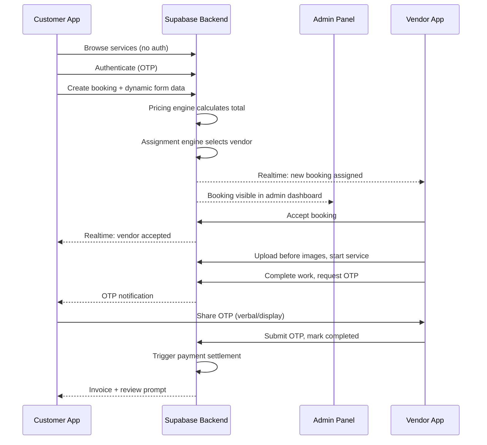
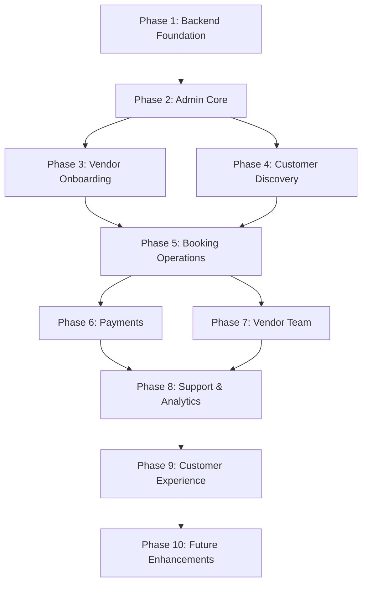

# DODO BOOKER — Master Architecture

> **Document Version:** 1.0  
> **Last Updated:** June 2026  
> **Scope:** Platform-wide architecture for Admin Panel, Vendor App, Customer App, and Supabase Backend

---

## Table of Contents

1. [Project Vision](#1-project-vision)
2. [Platform Overview](#2-platform-overview)
3. [Technology Stack](#3-technology-stack)
4. [High Level Architecture](#4-high-level-architecture)
5. [Dynamic Architecture Principles](#5-dynamic-architecture-principles)
6. [Modular Architecture Principles](#6-modular-architecture-principles)
7. [RBAC Principles](#7-rbac-principles)
8. [Application Communication](#8-application-communication)
9. [Module Overview](#9-module-overview)
10. [Folder Structure](#10-folder-structure)
11. [Development Order](#11-development-order)
12. [Scalability Considerations](#12-scalability-considerations)

---

## 1. Project Vision

DODO BOOKER is an enterprise-grade, on-demand service booking platform that connects customers with verified service vendors across multiple categories — cleaning, appliance repair, beauty, home maintenance, and beyond.

The platform vision is to build a **fully dynamic, RBAC-driven, modular ecosystem** where:

- **Business teams** configure categories, services, pricing, promotions, content, and operational rules through the Admin Panel — without developer intervention.
- **Customers** discover services, book appointments, pay, track jobs in real time, and manage their history through a mobile-first Flutter application and a PWA customer website.
- **Vendors** onboard, manage staff, accept jobs, complete work with proof, and track earnings through a dedicated Flutter mobile application.
- **Administrators** govern the entire marketplace — users, vendors, bookings, payments, SEO, analytics, and compliance — through a PWA Admin Panel.

### Core Vision Pillars

| Pillar | Description |
|--------|-------------|
| **Dynamic** | All business entities are data-driven and admin-configurable |
| **Modular** | Independent modules communicate through defined interfaces |
| **RBAC** | Permission-driven access at platform and vendor levels |
| **Scalable** | Multi-city, multi-country growth without architectural rewrites |
| **API-Driven** | All clients consume a single Supabase backend |
| **SEO-Friendly** | Content, metadata, and sitemaps managed dynamically |
| **PWA-Enabled** | Admin Panel and Customer Web support offline-capable progressive web apps |

### Final Goal

Deliver a marketplace where routine business operations — launching a new service category, adjusting pricing slabs, onboarding vendors, processing refunds, publishing SEO content — require **zero code changes**. The platform must scale from a single city to thousands of vendors and millions of customers while maintaining security, auditability, and operational clarity.

---

## 2. Platform Overview

DODO BOOKER consists of four primary surfaces and one shared backend:

```
┌─────────────────────────────────────────────────────────────────────────┐
│                         DODO BOOKER PLATFORM                            │
├─────────────────────────────────────────────────────────────────────────┤
│                                                                         │
│   ┌──────────────┐   ┌──────────────┐   ┌──────────────┐               │
│   │  Customer    │   │   Vendor     │   │    Admin     │               │
│   │  Application │   │ Application  │   │    Panel     │               │
│   │              │   │              │   │              │               │
│   │ Flutter      │   │ Flutter      │   │ PWA          │               │
│   │ Android/iOS  │   │ Android/iOS  │   │ (Web)        │               │
│   │ + PWA Web    │   │              │   │              │               │
│   └──────┬───────┘   └──────┬───────┘   └──────┬───────┘               │
│          │                  │                  │                        │
│          └──────────────────┼──────────────────┘                        │
│                             │                                           │
│                    ┌────────▼────────┐                                  │
│                    │    SUPABASE     │                                  │
│                    │    Backend      │                                  │
│                    │                 │                                  │
│                    │ • PostgreSQL    │                                  │
│                    │ • Auth          │                                  │
│                    │ • Realtime      │                                  │
│                    │ • Storage       │                                  │
│                    │ • Edge Functions│                                  │
│                    │ • RLS Policies  │                                  │
│                    └─────────────────┘                                  │
│                                                                         │
└─────────────────────────────────────────────────────────────────────────┘
```

### Application Roles

| Application | Primary Users | Purpose |
|-------------|---------------|---------|
| **Customer App** | End customers | Discover, book, pay, track, review services |
| **Customer Website (PWA)** | End customers (web) | Same customer experience via browser; SEO-optimized discovery |
| **Vendor App** | Service providers & staff | Manage bookings, team, earnings, work proof |
| **Admin Panel (PWA)** | Platform administrators | Govern all platform operations, content, and configuration |

### Key Domain Entities

The platform revolves around these shared domain concepts:

- **Geography:** Country → State → City → Zone → Area → Pincode
- **Catalog:** Category → Sub Category → Service → Attribute Groups → Attributes → Pricing Rules
- **Participants:** Customers, Vendors, Admin Users, Vendor Staff
- **Transactions:** Bookings, Payments, Invoices, Refunds, Settlements
- **Operations:** Assignments, Tickets, Notifications, Audit Logs

---

## 3. Technology Stack

### Backend — Supabase

| Component | Role |
|-----------|------|
| **PostgreSQL** | Primary data store for all business entities |
| **Supabase Auth** | OTP-based authentication for customers, vendors, and admins |
| **Row Level Security (RLS)** | Database-enforced authorization aligned with RBAC |
| **Supabase Realtime** | Live booking status, assignment, and notification updates |
| **Supabase Storage** | Document uploads, work proof images, profile photos, invoices |
| **Edge Functions** | Complex business logic: pricing engine, assignment engine, payment webhooks, notification dispatch |
| **Database Migrations** | Version-controlled schema evolution |
| **Seed Data** | Initial roles, permissions, and reference data |

### Mobile Applications — Flutter

| Application | Targets | Notes |
|-------------|---------|-------|
| **Customer App** | Android, iOS, Web (PWA) | Mobile-first; web build serves as PWA Customer Website |
| **Vendor App** | Android, iOS | Mobile-first; no web requirement in v1 |

Both Flutter apps are:

- API-driven (Supabase client SDK)
- Modular in folder and feature organization
- Dynamic in UI rendering (forms, pricing, content loaded from backend)

### Web Applications — PWA

| Application | Technology | Notes |
|-------------|------------|-------|
| **Admin Panel** | Modern web framework (PWA-enabled) | Responsive, mobile-friendly, offline support for critical views |
| **Customer Website** | Flutter Web (PWA build of Customer App) | SEO pages may be supplemented with server-rendered routes where needed |

### Cross-Cutting Concerns

| Concern | Implementation |
|---------|----------------|
| **Authentication** | Mobile OTP via Supabase Auth |
| **Authorization** | RBAC at app layer + RLS at database layer |
| **Notifications** | SMS, WhatsApp, Email, Push — template-driven, triggered by automation rules |
| **Payments** | UPI, Card, Net Banking, Cash on Delivery — recorded and reconciled via Admin |
| **Analytics** | Dashboard metrics and exportable reports (PDF, Excel, CSV) |
| **SEO** | Dynamic meta, schema, sitemaps, robots.txt — managed from Admin Panel |

---

## 4. High Level Architecture

### Layered Architecture

```
┌─────────────────────────────────────────────────────────────────┐
│                     PRESENTATION LAYER                          │
│  ┌─────────────┐  ┌─────────────┐  ┌─────────────┐             │
│  │ Customer    │  │ Vendor      │  │ Admin       │             │
│  │ Flutter/PWA │  │ Flutter     │  │ PWA         │             │
│  └─────────────┘  └─────────────┘  └─────────────┘             │
├─────────────────────────────────────────────────────────────────┤
│                     APPLICATION LAYER                           │
│  Feature Modules │ State Management │ Navigation │ RBAC Guards  │
├─────────────────────────────────────────────────────────────────┤
│                     API / SERVICE LAYER                         │
│  Supabase Client SDK │ Edge Function Calls │ Realtime Channels  │
├─────────────────────────────────────────────────────────────────┤
│                     DOMAIN / BUSINESS LAYER                     │
│  Edge Functions: Pricing Engine │ Assignment │ Notifications    │
├─────────────────────────────────────────────────────────────────┤
│                     DATA LAYER                                  │
│  PostgreSQL │ RLS Policies │ Storage Buckets │ Audit Logs        │
└─────────────────────────────────────────────────────────────────┘
```

### Data Flow — Booking Lifecycle



### Control Plane vs Data Plane

| Plane | Owner | Responsibility |
|-------|-------|----------------|
| **Control Plane** | Admin Panel | Configuration of all business rules, catalog, users, content, SEO |
| **Data Plane** | All Apps | Execution of bookings, payments, notifications, and real-time operations |

The Admin Panel is the **single source of truth** for configuration. Customer and Vendor apps are **consumers** of that configuration — they never define categories, services, or platform-level rules.

---

## 5. Dynamic Architecture Principles

Dynamic architecture ensures that business logic and content live in the database and Admin Panel, not in application source code.

### 5.1 Guiding Rules

1. **No hardcoded business data** — Categories, services, attributes, coupons, cities, roles, permissions, pages, SEO metadata, and notification templates are all database records.
2. **Admin-configurable everything** — Routine operations require no developer deployment.
3. **Schema-driven UI** — Booking forms, service detail pages, and pricing displays are rendered from attribute and pricing configurations.
4. **Rule-driven behavior** — Pricing rules, assignment rules, refund policies, and notification triggers are stored as configurable rules evaluated at runtime.
5. **Version-safe changes** — Deactivating or archiving entities preserves historical data integrity.

### 5.2 Dynamic Entity Catalog

| Entity | Configured By | Consumed By |
|--------|---------------|-------------|
| Categories & Sub Categories | Admin | Customer App, Vendor App |
| Services & Packages | Admin | Customer App, Vendor App |
| Attribute Groups & Attributes | Admin | Customer App (forms), Pricing Engine |
| Attribute Values | Admin | Customer App (dropdowns, options) |
| Pricing Slabs & Rules | Admin | Pricing Engine → Customer App |
| Add-ons | Admin | Customer App, Vendor App |
| Coupons & Promotions | Admin | Customer App |
| Cities, Zones, Pincodes | Admin | All apps |
| Document Requirements | Admin | Vendor App (KYC) |
| Notification Templates | Admin | Notification Engine |
| SEO & CMS Content | Admin | Customer Website, Admin Panel |
| Refund & Cancellation Rules | Admin | Customer App, Admin Panel |
| Commission & Tax Settings | Admin | Payment & Settlement modules |

### 5.3 Dynamic Service Hierarchy

```
Category
  └── Sub Category
        └── Service
              └── Attribute Groups
                    └── Attributes (Dropdown, Radio, Checkbox, Number, Text, Date, Multi Select)
                          └── Attribute Values
                                └── Pricing Slabs
                                      └── Pricing Rules (IF/AND/THEN conditions)
```

### 5.4 Dynamic Booking Form Builder

Booking forms are **generated at runtime** based on the service's configured attribute groups. Examples:

| Service | Dynamically Rendered Fields |
|---------|---------------------------|
| Home Cleaning | Property Type, Square Feet |
| Bathroom Cleaning | Number of Bathrooms |
| AC Repair | AC Type, Brand, Ton Capacity |

No service-specific forms exist in client source code.

### 5.5 Dynamic Pricing Engine

Pricing components configurable per service:

- Base Price
- Attribute-Based Price (slab matching)
- Add-On Charges
- Distance Charges
- Time-Based Charges
- Surge Pricing
- Taxes (GST, regional)
- Convenience Fees

**Pricing Rule Example:**

```
IF  Property Type = Furnished
AND Square Feet > 1000
THEN Add ₹500
```

The pricing engine runs server-side (Edge Functions) to prevent client-side manipulation.

### 5.6 Dynamic Geographic Availability

Service availability is location-driven:

```
Country → State → City → Zone → Area → Pincode
```

Vendors map themselves to coverage areas. Customers see only services available in their location.

### 5.7 Future Service Support

The dynamic model supports unlimited future categories — Cleaning, AC Repair, Plumbing, Electrical, Salon, Pest Control, Laundry, Car Wash, Appliance Repair — **without code changes**.

---

## 6. Modular Architecture Principles

### 6.1 Guiding Rules

1. **Independent modules** — Each module owns its domain logic, UI, and data access patterns.
2. **Defined interfaces** — Modules communicate through service interfaces, events, or shared API contracts — not direct internal imports across module boundaries.
3. **Single responsibility** — A module does one thing well (e.g., Booking Module does not manage SEO).
4. **Replaceable** — Modules can be extended or swapped (e.g., adding a new payment gateway) without affecting unrelated modules.
5. **Layered within modules** — Each module follows: UI → State/Controller → Repository → Supabase.

### 6.2 Module Anatomy

Every module across all applications follows a consistent internal structure:

```
module_name/
├── presentation/     # Screens, widgets, UI components
├── application/      # State management, controllers, use cases
├── domain/           # Models, interfaces, business rules (client-side)
└── data/             # Repositories, Supabase queries, DTOs
```

### 6.3 Platform Module Map

Modules are grouped into three tiers:

**Tier 1 — Foundation (build first)**

| Module | Admin | Customer | Vendor | Backend |
|--------|:-----:|:--------:|:------:|:-------:|
| Authentication | ✓ | ✓ | ✓ | ✓ |
| RBAC & Users | ✓ | — | ✓ | ✓ |
| Location Management | ✓ | ✓ | ✓ | ✓ |
| Settings | ✓ | — | — | ✓ |

**Tier 2 — Core Business**

| Module | Admin | Customer | Vendor | Backend |
|--------|:-----:|:--------:|:------:|:-------:|
| Service Management | ✓ | ✓ | ✓ | ✓ |
| Dynamic Attributes & Pricing | ✓ | ✓ | ✓ | ✓ |
| Vendor Management | ✓ | — | ✓ | ✓ |
| Booking Management | ✓ | ✓ | ✓ | ✓ |
| Assignment Engine | ✓ | — | ✓ | ✓ |
| Notification | ✓ | ✓ | ✓ | ✓ |

**Tier 3 — Extended Operations**

| Module | Admin | Customer | Vendor | Backend |
|--------|:-----:|:--------:|:------:|:-------:|
| Payment & Settlement | ✓ | ✓ | ✓ | ✓ |
| CRM | ✓ | — | — | ✓ |
| Sales (Quotation/Invoice) | ✓ | ✓ | — | ✓ |
| Coupon & Promotions | ✓ | ✓ | — | ✓ |
| Ticket & Complaint | ✓ | ✓ | ✓ | ✓ |
| Refund Management | ✓ | ✓ | — | ✓ |
| SEO & CMS | ✓ | ✓ | — | ✓ |
| Analytics & Reporting | ✓ | ✓ | ✓ | ✓ |
| Audit & Activity Logs | ✓ | — | — | ✓ |

### 6.4 Inter-Module Communication Patterns

| Pattern | Use Case | Example |
|---------|----------|---------|
| **Direct API call** | Module needs data from shared backend | Booking Module fetches service details from Service Module's tables |
| **Domain events** | Loose coupling between modules | Booking completed → triggers Notification, Payment, Analytics modules |
| **Shared kernel** | Common types and utilities | Location models, currency formatting, date utilities |
| **Edge Functions** | Server-side orchestration | Assignment Engine coordinates Vendor, Booking, and Location modules |

### 6.5 Module Independence Boundaries

- Customer App **cannot** create categories or services — it reads catalog data.
- Vendor App **cannot** create categories or services — it selects from admin-defined catalog.
- Vendor App **can** set prices only when admin allows vendor-controlled pricing.
- Admin Panel **is the only application** that creates, updates, or deletes platform-level configuration.

---

## 7. RBAC Principles

DODO BOOKER implements **two layers of RBAC**: platform-level (Admin) and organization-level (Vendor).

### 7.1 Platform RBAC (Admin Panel)

**Model:** `Users → Roles → Permissions`

```
Admin User
  └── assigned → Role(s)
        └── grants → Permission(s)
              └── controls → Module Actions
```

**Example Roles:**

| Role | Scope |
|------|-------|
| Super Admin | Full platform access |
| Operations Manager | Bookings, vendors, assignments |
| SEO Manager | SEO, CMS, content |
| Support Manager | Tickets, complaints, refunds |
| Finance Manager | Payments, invoices, settlements |
| Content Manager | Banners, blogs, FAQs |

**Example Permissions:**

| Permission | Action |
|------------|--------|
| `booking.view` | View booking list and details |
| `booking.assign` | Manually assign vendors to bookings |
| `vendor.approve` | Approve vendor applications |
| `seo.manage` | Edit SEO metadata and schema |
| `invoice.create` | Generate customer invoices |
| `refund.process` | Approve and process refunds |

Permissions are **dynamically configurable** — new permissions can be created and assigned without code changes.

### 7.2 Vendor RBAC (Vendor App)

**Model:** `Vendor Staff → Vendor Role → Vendor Permission`

**Example Roles:**

| Role | Typical Permissions |
|------|---------------------|
| Vendor Owner | Full vendor account access |
| Manager | Staff management, revenue, job assignment |
| Supervisor | Job oversight, team coordination |
| Technician | View jobs, upload images, complete service |
| Worker | View assigned tasks only |

**Example Permissions:**

| Permission | Action |
|------------|--------|
| `booking.accept` | Accept or reject assigned bookings |
| `staff.manage` | Create and manage team accounts |
| `earnings.view` | View revenue and wallet balance |
| `work.upload` | Upload before/after work images |
| `job.complete` | Mark jobs as completed |

Vendor Owner assigns roles and permissions to staff members.

### 7.3 Customer Access Model

Customers do not have RBAC roles. Access is binary:

| State | Access |
|-------|--------|
| **Unauthenticated** | Browse catalog, search, view reviews |
| **Authenticated** | Book, pay, view history, submit reviews, raise tickets |

### 7.4 RBAC Enforcement Layers

RBAC is enforced at three levels for defense in depth:

```
┌─────────────────────────────────────────────┐
│  Layer 1: UI Guards                         │
│  Hide/disable actions user cannot perform   │
├─────────────────────────────────────────────┤
│  Layer 2: API / Client Guards               │
│  Block unauthorized requests before sent    │
├─────────────────────────────────────────────┤
│  Layer 3: Database RLS Policies             │
│  PostgreSQL enforces row-level access       │
└─────────────────────────────────────────────┘
```

| Layer | Responsibility |
|-------|----------------|
| **UI Guards** | Hide/disable UI elements based on permissions |
| **API Guards** | Edge Functions validate permissions before execution |
| **RLS Policies** | Database-level enforcement — users can only read/write authorized rows |

### 7.5 Security Features

- Login logs and session logs
- Audit logs for all critical actions (user, action, timestamp, IP, module)
- Password policies (admin users)
- Two-Factor Authentication (future)
- Secure API communication with encrypted data transfer

### 7.6 Audit Trail

All critical actions are logged:

| Action | Logged Fields |
|--------|---------------|
| Vendor approved | User, timestamp, IP, vendor ID |
| Refund processed | User, timestamp, amount, booking ID |
| Service updated | User, timestamp, changed fields |
| Pricing changed | User, timestamp, old/new values |
| Role updated | User, timestamp, role changes |

---

## 8. Application Communication

### 8.1 Communication Topology

All applications communicate exclusively through the **Supabase Backend**. There is no direct app-to-app communication.

```
Customer App  ──┐
                ├──→  Supabase  ←──┐
Vendor App    ──┘    Backend       ├──  Admin Panel
                                     │
Customer PWA  ──────────────────────┘
```

### 8.2 Communication Mechanisms

| Mechanism | Use Case | Direction |
|-----------|----------|-----------|
| **REST (PostgREST)** | CRUD operations on all entities | Client → Database |
| **Realtime Subscriptions** | Booking status, assignment updates, OTP events | Backend → Client (push) |
| **Edge Functions** | Pricing calculation, vendor assignment, payment processing, notification dispatch | Client → Server → Client |
| **Storage API** | Document uploads, work proof images, invoices | Client → Storage |
| **Auth API** | OTP login, session management, token refresh | Client → Auth |

### 8.3 Realtime Event Channels

| Event | Publisher | Subscribers |
|-------|-----------|-------------|
| Booking created | Backend | Admin Panel, Vendor App |
| Vendor assigned | Assignment Engine | Customer App, Vendor App |
| Vendor accepted | Vendor App | Customer App, Admin Panel |
| Service started | Vendor App | Customer App |
| OTP generated | Backend | Customer App, Vendor App |
| Service completed | Vendor App | Customer App, Admin Panel |
| Payment received | Backend | Vendor App, Admin Panel |
| Refund approved | Admin Panel | Customer App |

### 8.4 Notification Dispatch

Notifications are triggered by automation rules configured in the Admin Panel:

```
Event Trigger (e.g., Booking Created)
  → Notification Engine (Edge Function)
    → Template Selection (dynamic variables)
      → Channel Dispatch (SMS / WhatsApp / Email / Push)
```

**Dynamic Template Variables:** Customer Name, Booking ID, Vendor Name, Service Name, OTP, Amount, etc.

### 8.5 Shared Data Contracts

All applications read from and write to the same PostgreSQL schema. Key shared tables include:

| Domain | Shared Entities |
|--------|-----------------|
| Catalog | categories, sub_categories, services, attributes, pricing_rules |
| Users | customers, vendors, admin_users, vendor_staff |
| Operations | bookings, assignments, work_proofs |
| Financial | payments, invoices, refunds, settlements, wallets |
| Support | tickets, complaints |
| Content | pages, blogs, faqs, banners, seo_metadata |
| Config | settings, roles, permissions, notification_templates |

### 8.6 Authentication Boundaries

| Application | Auth Method | Identity Type |
|-------------|-------------|---------------|
| Customer App / PWA | Mobile OTP | Customer |
| Vendor App | Mobile OTP, Password | Vendor / Vendor Staff |
| Admin Panel | Email + Password (OTP future) | Admin User |

Each identity type has separate RLS policies ensuring data isolation.

---

## 9. Module Overview

### 9.1 Admin Panel Modules

| # | Module | Key Capabilities |
|---|--------|------------------|
| 1 | RBAC & User Management | Roles, permissions, admin users, security logs |
| 2 | Service Management | Categories, sub categories, services, packages, add-ons |
| 2A | Dynamic Attributes & Pricing Engine | Attribute groups, dynamic forms, pricing slabs, pricing rules |
| 3 | Dynamic Pricing Engine | Base, add-on, distance, time, surge, tax pricing |
| 4 | Vendor Management | Onboarding, verification, lifecycle, performance, zone mapping |
| 5 | Booking Management | Full booking lifecycle, create/update/cancel/reschedule |
| 6 | Assignment Engine | Auto and manual vendor assignment with configurable rules |
| 7 | CRM | Customer profiles, history, tags |
| 8 | Sales | Quotations → Sales Orders → Invoices, GST, credit/debit notes |
| 9 | Payment Management | Payment recording, tracking, vendor settlements |
| 10 | Coupon & Promotions | Coupon builder, rules, campaigns, banners |
| 11 | Ticket & Complaint | Ticket lifecycle, SLA, escalation |
| 12 | Refund Management | Refund requests, configurable policies |
| 13 | SEO & CMS | Meta, schema, sitemaps, robots.txt, redirects |
| 14 | Content Management | Pages, FAQs, blogs, banners |
| 15 | Notification | Multi-channel templates and automation rules |
| 16 | Location Management | Geographic hierarchy, service availability |
| 17 | Settings | Platform, commission, tax, booking/cancellation rules |
| 18 | Analytics & Reporting | Dashboards, reports, exports (PDF, Excel, CSV) |
| 19 | Audit & Activity Logs | Critical action tracking |

### 9.2 Customer App Modules

| # | Module | Key Capabilities |
|---|--------|------------------|
| 1 | Authentication | Mobile OTP signup/login |
| 2 | Customer Profile | Basic info, profile completion enforcement |
| 3 | Address Management | Multiple addresses (home, office, other) |
| 4 | Home | Featured services, categories, banners, coupons |
| 5 | Category | Browse categories and sub categories |
| 6 | Service | Service details, pricing, reviews, images, FAQs |
| 7 | Add-On | Optional add-on selection |
| 8 | Service Package | Bundle purchasing |
| 9 | Search | Search categories, services, packages |
| 10 | Filter & Sorting | Category, price, rating, location filters |
| 11 | Booking | Full booking workflow |
| 12 | Advanced Scheduling | Date/time slots, same-day, future booking |
| 13 | Booking Tracking | Real-time status tracking |
| 14 | Real-Time Updates | Supabase Realtime integration |
| 15 | Payment | COD, UPI, card, net banking |
| 16 | Coupon | View, apply, remove coupons |
| 17 | Invoice | View, download, share invoices |
| 18 | Service Completion | OTP verification workflow |
| 19 | Review & Rating | Rate service and vendor |
| 20 | Feedback | Suggestions, complaints, service feedback |
| 21 | Booking History | Upcoming, ongoing, completed, cancelled |
| 22 | Rebooking | Quick rebook from history |
| 23 | Wishlist | Save services and packages |
| 24 | Notification | Push, SMS, WhatsApp, email |
| 25 | Ticket Support | Raise and track support requests |
| 26 | Refund | Request and track refunds |
| 27 | Before & After Gallery | View vendor work proof images |
| 28 | FAQ | Dynamic FAQ display |
| 29 | Promotional Content | Banners, featured items, offers |
| 30 | Customer Analytics | Bookings, spend, savings, favorites |

### 9.3 Vendor App Modules

| # | Module | Key Capabilities |
|---|--------|------------------|
| 1 | Authentication | OTP, password, email login |
| 2 | Vendor Profile | Business info, bank details |
| 3 | KYC & Document Verification | Dynamic document requirements |
| 4 | Service Selection | Select from admin-defined catalog |
| 5 | Service Pricing | Configure prices (when permitted) |
| 6 | Service Coverage | Geographic coverage and radius |
| 7 | Availability Management | Working days/hours, holidays, leave |
| 8 | Dashboard | Today's bookings, revenue, ratings |
| 9 | Booking Management | Accept, reject, start, complete |
| 10 | Job Details | Customer, service, schedule, notes |
| 11 | Work Proof | Before/after images, work notes |
| 12 | OTP Verification | Customer OTP for completion |
| 13 | Wallet & Earnings | Balance, transactions, withdrawals |
| 14 | Settlement | Settlement tracking and history |
| 15 | Customer Feedback | View ratings and reviews |
| 16 | Customer Rating | Rate customers for dispute management |
| 17 | Team Management | Staff account CRUD |
| 18 | Vendor Staff RBAC | Role and permission assignment |
| 19 | Internal Job Assignment | Assign bookings to team members |
| 20 | Notification | Multi-channel notifications |
| 21 | Ticket Support | Raise support tickets |
| 22 | Document Expiry Tracking | License, insurance, GST expiry alerts |
| 23 | Vendor Analytics | Revenue, booking, performance analytics |
| 24 | Vendor Performance | Acceptance rate, response time, satisfaction |
| 25 | Service Pause | Temporarily disable account/services/locations |

### 9.4 Backend Modules (Supabase)

| Module | Components |
|--------|------------|
| **Schema & Migrations** | PostgreSQL tables, indexes, constraints |
| **RLS Policies** | Per-table row-level security aligned with RBAC |
| **Edge Functions** | Pricing engine, assignment engine, notification dispatcher, payment webhooks |
| **Storage Buckets** | Documents, work proofs, profile images, invoices |
| **Seed Data** | Default roles, permissions, settings |
| **Realtime** | Publication channels for booking and notification events |

---

## 10. Folder Structure

### 10.1 Repository Root

```
DODO-Booker/
├── admin-panel/                  # PWA Admin Panel (web)
├── customer-app/                 # Flutter Customer App (Android, iOS, Web/PWA)
├── vendor-app/                   # Flutter Vendor App (Android, iOS)
├── supabase/                     # Shared Supabase backend
│   ├── migrations/               # Database schema migrations
│   ├── policies/                 # RLS policy definitions
│   ├── functions/                # Edge Functions
│   └── seed/                     # Seed data (roles, permissions, defaults)
├── docs/                         # Platform documentation
│   ├── MASTER_ARCHITECTURE.md    # This document
│   ├── ADMIN_PANEL.md            # Admin Panel specification
│   ├── VENDOR_APP.md             # Vendor App specification
│   ├── CUSTOMER_APP.md           # Customer App specification
│   ├── DATABASE_ARCHITECTURE.md  # Database schema documentation
│   ├── RBAC_ARCHITECTURE.md      # RBAC deep-dive
│   ├── MODULE_DEPENDENCIES.md    # Module dependency graph
│   ├── DEVELOPMENT_ROADMAP.md    # Development timeline
│   └── GIT_WORKFLOW.md           # Git branching and workflow
└── README.md                     # Project overview and setup
```

### 10.2 Admin Panel (PWA)

```
admin-panel/
├── public/                       # Static assets, PWA manifest, service worker
├── src/
│   ├── core/                     # App shell, routing, theme, config
│   │   ├── auth/                 # Authentication guards
│   │   ├── rbac/                 # Permission guards, role checks
│   │   └── api/                  # Supabase client, API helpers
│   ├── modules/                  # Feature modules (one folder per module)
│   │   ├── rbac/
│   │   ├── services/
│   │   ├── vendors/
│   │   ├── bookings/
│   │   ├── assignment/
│   │   ├── crm/
│   │   ├── sales/
│   │   ├── payments/
│   │   ├── coupons/
│   │   ├── tickets/
│   │   ├── refunds/
│   │   ├── seo/
│   │   ├── cms/
│   │   ├── notifications/
│   │   ├── locations/
│   │   ├── settings/
│   │   ├── analytics/
│   │   └── audit/
│   └── shared/                   # Shared components, hooks, utilities
└── README.md
```

### 10.3 Customer App (Flutter)

```
customer-app/
├── android/
├── ios/
├── web/                          # PWA build configuration
├── lib/
│   ├── core/                     # App config, routing, theme, DI
│   │   ├── auth/
│   │   ├── api/                  # Supabase client
│   │   └── utils/
│   ├── modules/                  # Feature modules
│   │   ├── authentication/
│   │   ├── profile/
│   │   ├── address/
│   │   ├── home/
│   │   ├── category/
│   │   ├── service/
│   │   ├── addon/
│   │   ├── package/
│   │   ├── search/
│   │   ├── filter/
│   │   ├── booking/
│   │   ├── scheduling/
│   │   ├── tracking/
│   │   ├── payment/
│   │   ├── coupon/
│   │   ├── invoice/
│   │   ├── review/
│   │   ├── feedback/
│   │   ├── history/
│   │   ├── rebooking/
│   │   ├── wishlist/
│   │   ├── notification/
│   │   ├── ticket/
│   │   ├── refund/
│   │   ├── gallery/
│   │   ├── faq/
│   │   ├── promotions/
│   │   └── analytics/
│   └── shared/                   # Shared widgets, models, extensions
├── assets/
└── README.md
```

### 10.4 Vendor App (Flutter)

```
vendor-app/
├── android/
├── ios/
├── lib/
│   ├── core/
│   │   ├── auth/
│   │   ├── rbac/                 # Vendor-level RBAC guards
│   │   ├── api/
│   │   └── utils/
│   ├── modules/
│   │   ├── authentication/
│   │   ├── profile/
│   │   ├── kyc/
│   │   ├── service_selection/
│   │   ├── pricing/
│   │   ├── coverage/
│   │   ├── availability/
│   │   ├── dashboard/
│   │   ├── booking/
│   │   ├── job_details/
│   │   ├── work_proof/
│   │   ├── otp_verification/
│   │   ├── wallet/
│   │   ├── settlement/
│   │   ├── feedback/
│   │   ├── customer_rating/
│   │   ├── team/
│   │   ├── staff_rbac/
│   │   ├── job_assignment/
│   │   ├── notification/
│   │   ├── ticket/
│   │   ├── document_expiry/
│   │   ├── analytics/
│   │   ├── performance/
│   │   └── service_pause/
│   └── shared/
├── assets/
└── README.md
```

### 10.5 Supabase Backend

```
supabase/
├── migrations/
│   ├── 00001_initial_schema.sql
│   ├── 00002_rbac_tables.sql
│   ├── 00003_service_catalog.sql
│   ├── 00004_booking_tables.sql
│   ├── 00005_payment_tables.sql
│   └── ...
├── policies/
│   ├── admin_policies.sql
│   ├── customer_policies.sql
│   ├── vendor_policies.sql
│   └── public_read_policies.sql
├── functions/
│   ├── pricing-engine/
│   ├── assignment-engine/
│   ├── notification-dispatcher/
│   ├── payment-webhook/
│   └── otp-generator/
└── seed/
    ├── roles.sql
    ├── permissions.sql
    └── default_settings.sql
```

---

## 11. Development Order

Development follows a **foundation-first, dependency-aware** sequence. Each phase builds on the previous and unlocks the next set of applications and modules.

### Phase 1 — Backend Foundation

**Goal:** Establish the data layer, authentication, and authorization skeleton.

| Step | Deliverable |
|------|-------------|
| 1.1 | Supabase project setup, environment configuration |
| 1.2 | Core schema: users, roles, permissions, audit logs |
| 1.3 | RLS policies for admin, customer, vendor identity types |
| 1.4 | Auth configuration: OTP for customers and vendors, email/password for admins |
| 1.5 | Seed data: default roles, permissions, settings |
| 1.6 | Geographic schema: country, state, city, zone, area, pincode |

**Unlocks:** Admin Panel auth, basic user management

---

### Phase 2 — Admin Core (Control Plane)

**Goal:** Enable administrators to configure the platform.

| Step | Deliverable |
|------|-------------|
| 2.1 | Admin Panel shell: PWA setup, routing, auth, RBAC guards |
| 2.2 | RBAC Module: role/permission/user management |
| 2.3 | Location Management Module |
| 2.4 | Service Management: categories, sub categories, services |
| 2.5 | Dynamic Attributes & Pricing Engine |
| 2.6 | Settings Module: platform rules, commission, tax |
| 2.7 | CMS Module: pages, FAQs, banners |
| 2.8 | SEO Module: meta, schema, sitemaps |

**Unlocks:** Customer App browsing, Vendor App service selection

---

### Phase 3 — Vendor Onboarding

**Goal:** Vendors can register, verify, and configure their presence.

| Step | Deliverable |
|------|-------------|
| 3.1 | Vendor App shell: Flutter setup, auth, navigation |
| 3.2 | Authentication Module (OTP, password) |
| 3.3 | Vendor Profile Module |
| 3.4 | KYC & Document Verification (dynamic requirements from admin) |
| 3.5 | Service Selection Module |
| 3.6 | Service Coverage & Availability Modules |
| 3.7 | Admin Vendor Management Module (approval workflow) |

**Unlocks:** Vendor lifecycle management, service availability per zone

---

### Phase 4 — Customer Discovery & Booking

**Goal:** Customers can browse, book, and schedule services.

| Step | Deliverable |
|------|-------------|
| 4.1 | Customer App shell: Flutter setup (Android, iOS, Web/PWA) |
| 4.2 | Home, Category, Service, Search, Filter modules (no auth required) |
| 4.3 | Authentication Module (OTP) |
| 4.4 | Profile & Address modules |
| 4.5 | Dynamic Booking Form (rendered from attribute config) |
| 4.6 | Pricing Engine Edge Function |
| 4.7 | Booking creation and scheduling |
| 4.8 | Add-on, Package, Coupon modules |

**Unlocks:** End-to-end booking creation

---

### Phase 5 — Booking Operations

**Goal:** Complete the booking lifecycle across all apps.

| Step | Deliverable |
|------|-------------|
| 5.1 | Assignment Engine (auto + manual rules) |
| 5.2 | Vendor Booking Management (accept, reject, start, complete) |
| 5.3 | Customer Booking Tracking (realtime status) |
| 5.4 | Work Proof Module (before/after images) |
| 5.5 | OTP Verification workflow |
| 5.6 | Admin Booking Management |
| 5.7 | Notification Module (templates, automation, multi-channel) |
| 5.8 | Realtime subscriptions for all booking events |

**Unlocks:** Full booking lifecycle from creation to completion

---

### Phase 6 — Payments & Financial

**Goal:** Handle money flow across the platform.

| Step | Deliverable |
|------|-------------|
| 6.1 | Customer Payment Module |
| 6.2 | Payment recording and tracking (Admin) |
| 6.3 | Invoice generation (Sales Module) |
| 6.4 | Vendor Wallet & Earnings |
| 6.5 | Settlement processing |
| 6.6 | Refund Management (customer request + admin processing) |
| 6.7 | Coupon & Promotions (full lifecycle) |

**Unlocks:** Revenue tracking, vendor payouts, financial reporting

---

### Phase 7 — Vendor Team & Internal Operations

**Goal:** Vendors operate with teams and internal workflows.

| Step | Deliverable |
|------|-------------|
| 7.1 | Vendor Team Management |
| 7.2 | Vendor Staff RBAC |
| 7.3 | Internal Job Assignment |
| 7.4 | Vendor Analytics & Performance |
| 7.5 | Document Expiry Tracking |
| 7.6 | Service Pause Module |
| 7.7 | Customer Rating (vendor rates customer) |

**Unlocks:** Multi-staff vendor operations

---

### Phase 8 — Support, CRM & Analytics

**Goal:** Operational maturity for scale.

| Step | Deliverable |
|------|-------------|
| 8.1 | Ticket & Complaint Management (all apps) |
| 8.2 | CRM Module (customer profiles, tags, history) |
| 8.3 | Review & Rating (customer rates vendor/service) |
| 8.4 | Feedback Module |
| 8.5 | Admin Analytics & Reporting (dashboards, exports) |
| 8.6 | Customer Analytics |
| 8.7 | Audit & Activity Logs |
| 8.8 | Before & After Gallery (customer view) |

**Unlocks:** Full platform operations, reporting, customer support

---

### Phase 9 — Customer Experience Enhancements

**Goal:** Retention and engagement features.

| Step | Deliverable |
|------|-------------|
| 9.1 | Booking History & Rebooking |
| 9.2 | Wishlist |
| 9.3 | Promotional Content |
| 9.4 | Customer Website PWA optimization |
| 9.5 | SEO-driven landing pages |

**Unlocks:** Customer retention, organic discovery

---

### Phase 10 — Future Enhancements

| Feature | Application |
|---------|-------------|
| Referral Program | Customer App |
| Wallet System | Customer App |
| Loyalty Rewards | Customer App |
| Live Vendor Tracking | Customer App |
| Recurring Booking | Customer App |
| Subscription Plans | Vendor App |
| AI-Based Recommendations | Customer App |
| AI Assignment Recommendations | Vendor App / Admin |
| Route Optimization | Vendor App |
| Staff Attendance Tracking | Vendor App |
| Inventory Management | Vendor App |
| Two-Factor Authentication | Admin Panel |
| Emergency Services | Customer App |

---

### Development Dependency Graph



---

## 12. Scalability Considerations

### 12.1 Data Scalability

| Strategy | Implementation |
|----------|----------------|
| **Indexed queries** | All foreign keys, status fields, and date columns indexed |
| **Partitioning** | Booking and audit tables partitioned by date at scale |
| **Archival** | Completed bookings older than N months moved to archive tables |
| **Read replicas** | Supabase read replicas for analytics and reporting queries |
| **Connection pooling** | PgBouncer for efficient connection management |

### 12.2 Geographic Scalability

The platform is designed for **multi-city and multi-country** expansion:

| Level | Scalability Approach |
|-------|---------------------|
| **City expansion** | Add cities/zones via Admin Panel — no code changes |
| **Country expansion** | Add countries/states with regional tax and compliance settings |
| **Service localization** | Services, pricing, and content configured per geography |
| **Vendor distribution** | Assignment engine factors distance, zone, and availability |

### 12.3 User Scalability

| User Type | Scale Target | Strategy |
|-----------|-------------|----------|
| **Customers** | Millions | Stateless clients, CDN for static assets, efficient catalog queries |
| **Vendors** | Thousands per city | Zone-based assignment limits search space |
| **Admin users** | Tens to hundreds | RBAC ensures minimal privilege per user |

### 12.4 Performance Strategies

| Area | Approach |
|------|----------|
| **Catalog browsing** | Cached category/service trees, pagination, lazy loading |
| **Booking creation** | Optimistic UI with server-side validation via Edge Functions |
| **Realtime updates** | Targeted Supabase channels per booking (not global) |
| **Pricing calculation** | Server-side Edge Function (never trust client) |
| **File uploads** | Direct-to-storage uploads with size limits and compression |
| **Search** | Full-text search indexes on PostgreSQL or dedicated search service at scale |
| **Admin dashboards** | Materialized views or scheduled aggregation for heavy metrics |

### 12.5 Module Scalability

| Principle | Benefit |
|-----------|---------|
| **Independent modules** | Scale development teams per module without conflicts |
| **Edge Functions per domain** | Scale pricing, assignment, and notification compute independently |
| **Event-driven notifications** | Decouple notification dispatch from booking flow |
| **Feature flags** | Enable/disable modules per city or rollout phase |

### 12.6 Infrastructure Scalability

| Component | Scaling Path |
|-----------|-------------|
| **Supabase Database** | Vertical scaling → read replicas → connection pooling |
| **Edge Functions** | Stateless, auto-scaling per invocation |
| **Storage** | Supabase Storage with CDN for media delivery |
| **Realtime** | Channel-per-entity pattern avoids broadcast storms |

### 12.7 Security at Scale

| Concern | Mitigation |
|---------|------------|
| **RLS performance** | Optimize policies with indexed columns, avoid complex joins in policies |
| **Rate limiting** | Edge Function rate limits on auth and booking endpoints |
| **Audit volume** | Async audit log writes, partitioned storage |
| **OTP abuse** | Rate limiting, CAPTCHA at scale |

### 12.8 Operational Scalability

| Concern | Approach |
|---------|----------|
| **Multi-team operations** | RBAC roles isolate responsibilities (ops, finance, SEO, support) |
| **Multi-city management** | Location-scoped admin permissions (future) |
| **Monitoring** | Supabase dashboard metrics, custom alerts on booking/payment failures |
| **Disaster recovery** | Supabase automated backups, point-in-time recovery |

---

## Appendix A — Glossary

| Term | Definition |
|------|------------|
| **Attribute** | A configurable field on a service (e.g., Property Type, AC Brand) |
| **Attribute Group** | A logical grouping of attributes (e.g., Cleaning Attributes) |
| **Pricing Slab** | A price mapped to a specific attribute value combination |
| **Pricing Rule** | A conditional rule that modifies pricing (IF/AND/THEN) |
| **Assignment Engine** | Server-side logic that matches bookings to vendors |
| **RLS** | Row Level Security — PostgreSQL feature enforced by Supabase |
| **PWA** | Progressive Web App — web app with offline and install capabilities |
| **OTP** | One-Time Password — used for authentication and service completion |
| **KYC** | Know Your Customer — vendor document verification process |
| **Settlement** | Transfer of earned funds from platform to vendor |

## Appendix B — Related Documents

| Document | Purpose |
|----------|---------|
| [ADMIN_PANEL.md](./ADMIN_PANEL.md) | Detailed Admin Panel module specifications |
| [VENDOR_APP.md](./VENDOR_APP.md) | Detailed Vendor App module specifications |
| [CUSTOMER_APP.md](./CUSTOMER_APP.md) | Detailed Customer App module specifications |
| [DATABASE_ARCHITECTURE.md](./DATABASE_ARCHITECTURE.md) | Database schema and entity relationships |
| [RBAC_ARCHITECTURE.md](./RBAC_ARCHITECTURE.md) | RBAC model deep-dive |
| [MODULE_DEPENDENCIES.md](./MODULE_DEPENDENCIES.md) | Inter-module dependency graph |
| [DEVELOPMENT_ROADMAP.md](./DEVELOPMENT_ROADMAP.md) | Timeline and milestone tracking |
| [GIT_WORKFLOW.md](./GIT_WORKFLOW.md) | Branching strategy and contribution guidelines |

---

*This document is the authoritative reference for DODO BOOKER platform architecture. All application development should align with the principles, module boundaries, and development order defined herein.*
